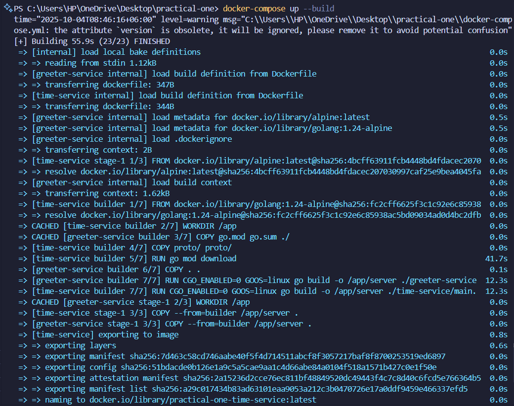
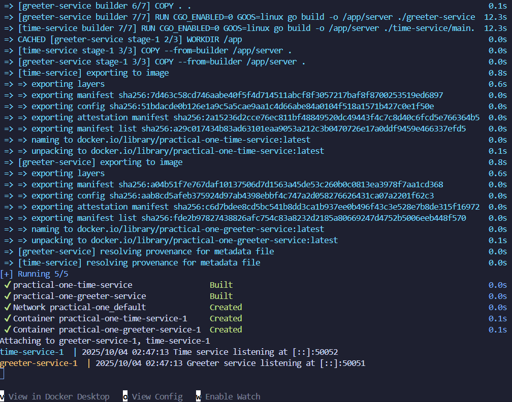
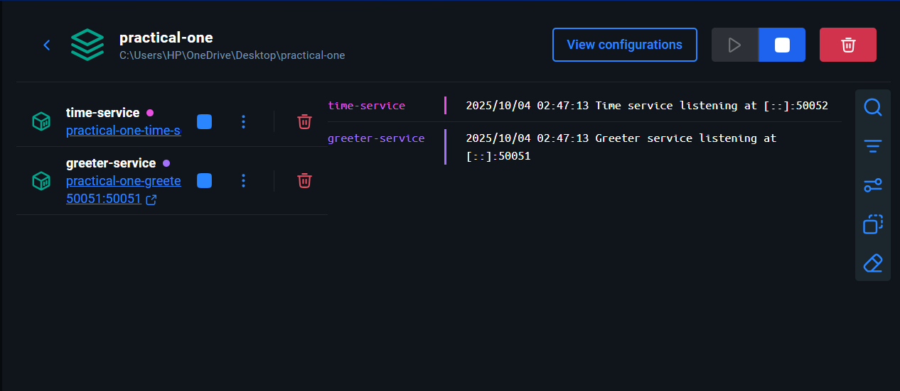
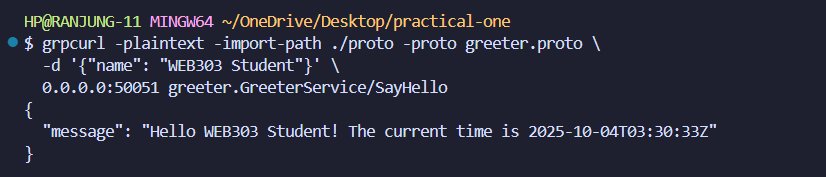

# WEB303 Practical 1: Microservices with gRPC and Docker

## Student Information
- **Student ID**: 02230297
- **Repository**: [AS2025_WEB303_02230297_Practical1](https://github.com/Rynorbu/AS2025_WEB303_02230297_Practical1)


## Overview

This practical demonstrates the implementation of communicating microservices using Go, gRPC, Protocol Buffers, and Docker Compose. The project consists of two microservices:

1. **Time Service**: Provides current timestamp functionality
2. **Greeter Service**: Provides personalized greetings with current time by calling the Time Service

## Architecture

```
┌─────────────────┐    gRPC Call    ┌─────────────────┐
│                 │ ──────────────► │                 │
│ Greeter Service │                 │  Time Service   │
│   Port: 50051   │ ◄────────────── │   Port: 50052   │
│                 │   Time Response │                 │
└─────────────────┘                 └─────────────────┘
        │                                    │
        │                                    │
        ▼                                    ▼
   Public API                         Internal Service
   (External Access)                  (Container Network)
```

## Project Structure

```
practical-one/
├── docker-compose.yml          # Container orchestration
├── go.mod                      # Root Go module
├── go.sum                      # Dependency checksums
├── README.md                   # This file
├── greeter-service/
│   ├── Dockerfile              # Greeter service container
│   ├── go.mod                  # Greeter service module
│   ├── go.sum                  # Greeter dependencies
│   └── main.go                 # Greeter service implementation
├── time-service/
│   ├── Dockerfile              # Time service container
│   ├── go.mod                  # Time service module
│   ├── go.sum                  # Time dependencies
│   └── main.go                 # Time service implementation
└── proto/
    ├── greeter.proto           # Greeter service contract
    ├── time.proto              # Time service contract
    └── gen/
        └── proto/
            ├── greeter.pb.go           # Generated Greeter protobuf code
            ├── greeter_grpc.pb.go      # Generated Greeter gRPC code
            ├── time.pb.go              # Generated Time protobuf code
            └── time_grpc.pb.go         # Generated Time gRPC code
```

## Implementation Approach

### 1. Service Contracts (Protocol Buffers)

#### Time Service Contract (`proto/time.proto`)
```protobuf
syntax = "proto3";
option go_package = "practical-one/proto/gen;gen";
package time;

service TimeService {
  rpc GetTime(TimeRequest) returns (TimeResponse);
}

message TimeRequest {}
message TimeResponse {
  string current_time = 1;
}
```

#### Greeter Service Contract (`proto/greeter.proto`)
```protobuf
syntax = "proto3";
option go_package = "practical-one/proto/gen;gen";
package greeter;

service GreeterService {
  rpc SayHello(HelloRequest) returns (HelloResponse);
}

message HelloRequest {
  string name = 1;
}
message HelloResponse {
  string message = 1;
}
```

### 2. Code Generation
Generated Go code from Protocol Buffer definitions using:
```bash
protoc --go_out=./proto/gen --go_opt=paths=source_relative \
       --go-grpc_out=./proto/gen --go-grpc_opt=paths=source_relative \
       proto/*.proto
```

### 3. Service Implementation

#### Time Service
- **Port**: 50052 (internal)
- **Functionality**: Returns current timestamp in RFC3339 format
- **Dependencies**: Standard Go libraries + gRPC

#### Greeter Service
- **Port**: 50051 (exposed)
- **Functionality**: 
  - Accepts greeting requests with a name
  - Makes gRPC call to Time Service
  - Returns combined greeting with current time
- **Dependencies**: gRPC client for Time Service communication

### 4. Containerization Strategy

#### Multi-stage Docker Builds
Both services use optimized multi-stage Dockerfiles:
1. **Builder Stage**: golang:1.24-alpine for compilation
2. **Runtime Stage**: alpine:latest for minimal production image

#### Service Communication
- Services communicate via Docker internal network
- Greeter service connects to `time-service:50052` hostname
- Only Greeter service (port 50051) exposed to host

### 5. Orchestration with Docker Compose
```yaml
version: '3.8'
services:
  time-service:
    build:
      context: .
      dockerfile: time-service/Dockerfile
    hostname: time-service

  greeter-service:
    build:
      context: .
      dockerfile: greeter-service/Dockerfile
    hostname: greeter-service
    ports:
      - "50051:50051"
    depends_on:
      - time-service
```

## Steps Taken

### Phase 1: Environment Setup
1.  Installed and configured Go 1.24.5
2.  Installed Protocol Buffer compiler and Go plugins
3.  Set up Docker Desktop
4.  Verified installations with test commands

### Phase 2: Project Setup
1.  Created directory structure
2.  Defined service contracts in Protocol Buffers
3.  Generated Go code from proto definitions
4.  Initialized Go modules for each service

### Phase 3: Service Implementation
1.  Implemented Time Service with gRPC server
2.  Implemented Greeter Service with gRPC server and client
3.  Configured inter-service communication
4.  Added proper error handling and logging

### Phase 4: Containerization
1.  Created optimized Dockerfiles for both services
2.  Set up Docker Compose for orchestration
3.  Configured service dependencies and networking
4.  Exposed appropriate ports

### Phase 5: Testing and Validation
1.  Built and deployed services using Docker Compose
2.  Installed and configured grpcurl for testing
3.  Verified end-to-end functionality
4.  Confirmed inter-service communication

## Challenges Encountered and Solutions

### 1. Go Version Compatibility Issue
**Problem**: Initial Dockerfiles used Go 1.24.2, but go.mod files required Go 1.24.5+
```
go: go.mod requires go >= 1.24.5 (running go 1.24.2; GOTOOLCHAIN=local)
```
**Solution**: Updated Dockerfiles to use `golang:1.24-alpine` which automatically uses the latest 1.24.x version

### 2. Module Import Path Resolution
**Problem**: Generated protobuf code couldn't be found during build
```
package practical-one/proto/gen is not in std
```
**Solution**: 
- Created unified root `go.mod` file with proper module replacement
- Updated Dockerfiles to use root module instead of individual service modules
- Added replace directive: `replace practical-one/proto/gen => ./proto/gen/proto`

### 3. Docker Build Context Issues
**Problem**: Protobuf files not accessible during Docker build due to context limitations
**Solution**: 
- Moved to unified module approach at project root
- Updated Dockerfiles to copy `go.mod` and `go.sum` from root
- Ensured all dependencies available in build context

### 4. Dependency Checksum Mismatches
**Problem**: go.sum checksums didn't match during Docker build
**Solution**: Generated fresh go.sum file with correct checksums for all dependencies

### 5. Service Discovery in Containers
**Problem**: Initial service used `localhost:50052` which doesn't work in container environment
**Solution**: Updated connection string to use Docker service name `time-service:50052`

## Evidence and Screenshots

This section provides visual evidence of the successful implementation and testing of the microservices.

### 1. Docker Compose Build Process
The following screenshots show the successful build and deployment of both microservices using Docker Compose.

#### Initial Build Process

*Screenshot showing the Docker Compose build process starting, including image pulling and dependency resolution.*

#### Build Completion and Service Startup

*Screenshot showing the successful completion of the build process and both services starting up with their respective logs.*

### 2. Running Containers Verification

*Screenshot showing both microservices running successfully in Docker containers with proper port mappings and status.*

### 3. gRPC Service Testing

*Screenshot demonstrating successful gRPC communication between services, showing the greeter service calling the time service and returning a combined response with greeting and current timestamp.*

## Testing Results

### Successful gRPC Communication Test
```bash
$ grpcurl -plaintext -import-path ./proto -proto greeter.proto \
  -d '{"name": "WEB303 Student"}' localhost:50051 greeter.GreeterService/SayHello

Response:
{
  "message": "Hello WEB303 Student! The current time is 2025-10-04T03:30:03Z"
}
```

### Service Status Verification
```bash
$ docker-compose ps
NAME                              SERVICE           STATUS    PORTS
practical-one-greeter-service-1   greeter-service   Up        0.0.0.0:50051->50051/tcp
practical-one-time-service-1      time-service      Up        50052/tcp
```

## Key Learning Outcomes Achieved

### Learning Outcome 2: Microservices with gRPC
 Successfully designed and implemented two microservices using gRPC and Protocol Buffers
- Efficient binary serialization
- Strong typing with generated code
- Bi-directional streaming capabilities (foundation set)

### Learning Outcome 6: Container Orchestration
 Deployed microservices using Docker Compose as foundation for Kubernetes
- Multi-container application management
- Service discovery and networking
- Dependency management between services

### Learning Outcome 1: Microservices Concepts
 Demonstrated fundamental microservices principles
- Service separation and independence
- Inter-service communication protocols
- Container-based deployment strategies

## Dependencies and Technologies Used

- **Go 1.24.5**: Primary programming language
- **gRPC**: Inter-service communication framework
- **Protocol Buffers**: Interface definition and serialization
- **Docker & Docker Compose**: Containerization and orchestration
- **Alpine Linux**: Minimal container base images
- **grpcurl**: Testing and debugging gRPC services

## Usage Instructions

### Prerequisites
- Docker and Docker Compose installed
- Go 1.24+ (for local development)
- grpcurl (for testing)

### Running the Application
1. Clone the repository
2. Navigate to project directory
3. Build and start services:
   ```bash
   docker-compose up --build
   ```

### Testing the Services
```bash
# Test Greeter Service (includes Time Service call)
grpcurl -plaintext -import-path ./proto -proto greeter.proto \
  -d '{"name": "Your Name"}' localhost:50051 greeter.GreeterService/SayHello
```

## Repository Links
- **GitHub Repository**: https://github.com/Rynorbu/AS2025_WEB303_02230297_Practical1
- **Practical Requirements**: https://github.com/douglasswmcst/ss2025_web303/blob/master/practicals/practical1.md

---

**Note**: This implementation successfully fulfills all requirements of WEB303 Practical 1, demonstrating foundational microservices concepts, gRPC communication, and containerized deployment strategies.