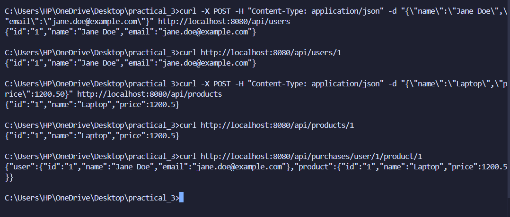
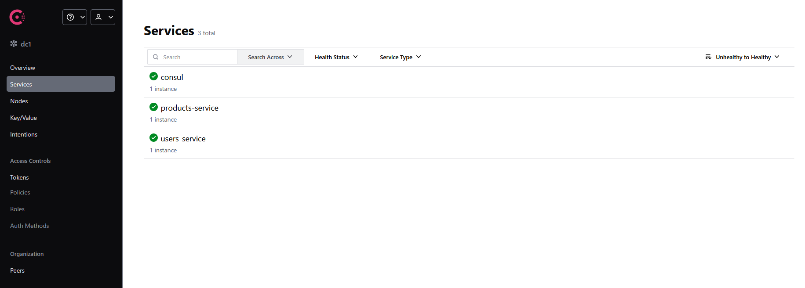
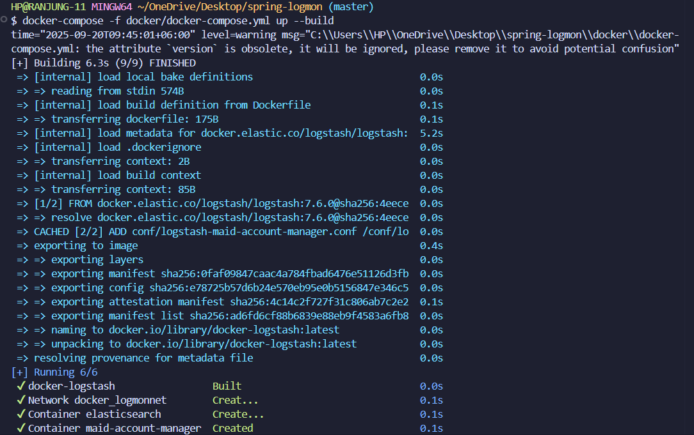
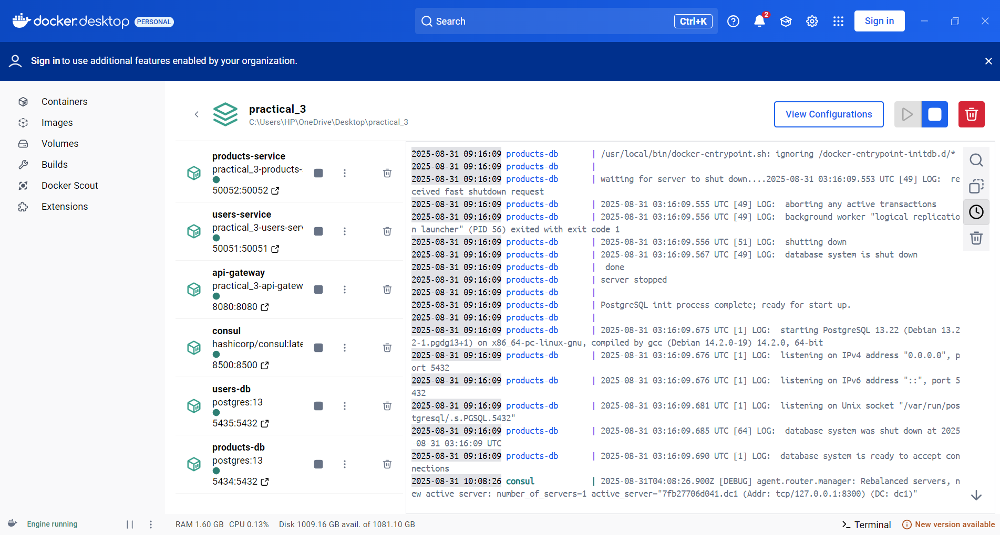
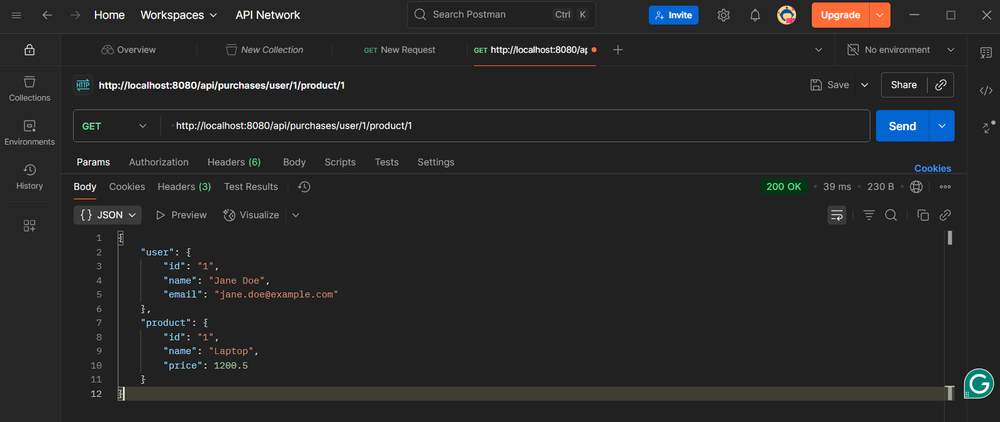

# Practical 3: Full-Stack Microservices with gRPC, Databases, and Service Discovery

## Table of Contents

- [Overview](#overview)
- [Architecture](#architecture)
- [My Approach](#my-approach)
- [Implementation Steps](#implementation-steps)
- [Key Features](#key-features)
- [Challenges Encountered](#challenges-encountered)
- [Technical Solutions](#technical-solutions)
- [Testing Results](#testing-results)
- [Evidence Documentation](#evidence-documentation)
- [API Documentation](#api-documentation)
- [What I Learned](#what-i-learned)
- [Objectives Achieved](#objectives-achieved)
- [Conclusion](#conclusion)

## Overview

This project demonstrates a full-stack microservices architecture that implements modern cloud-native design patterns. The system is built around two independent microservices for managing users and products. These services communicate through gRPC protocol, maintain their own PostgreSQL databases, and register themselves with HashiCorp Consul for dynamic service discovery. An API Gateway acts as the entry point, converting HTTP REST requests into gRPC calls and aggregating data from multiple services.

The main focus of this practical was to fix the API Gateway to properly utilize Consul service discovery instead of relying on hardcoded service addresses, and to implement proper inter-service communication for endpoints that need to aggregate data from multiple sources.

**Repository**: [https://github.com/Rynorbu/AS2025_WEB303_02230297_Practical3](https://github.com/Rynorbu/AS2025_WEB303_02230297_Practical3)

## Architecture

The system implements a distributed microservices architecture with the following components working together:

```
┌─────────────────┐    ┌──────────────────┐    ┌─────────────────┐
│   API Gateway   │◄──►│ Consul Discovery │◄──►│  Microservices  │
│   (Port 8080)   │    │   (Port 8500)    │    │                 │
│                 │    │                  │    │ Users Service   │
│ 1. Query Consul │    │ Service Registry │    │ (Port 50051)    │
│ 2. Get Addresses│    │                  │    │                 │
│ 3. Connect to   │    │ Health Checks    │    │ Products Service│
│    Services     │    │                  │    │ (Port 50052)    │
└─────────────────┘    └──────────────────┘    └─────────────────┘
                                               │                 │
┌─────────────────┐    ┌──────────────────┐    │                 │
│   PostgreSQL    │◄───│   PostgreSQL     │◄───┘                 │
│   Users DB      │    │   Products DB    │                      │
│   (Port 5432)   │    │   (Port 5433)    │                      │
└─────────────────┘    └──────────────────┘                      │
```

### Core Components

| Component | Technology | Port | Purpose |
|-----------|------------|------|---------|
| API Gateway | Go with Gorilla Mux | 8080 | HTTP REST API with dynamic service discovery |
| Users Service | Go with gRPC and GORM | 50051 | User management microservice |
| Products Service | Go with gRPC and GORM | 50052 | Product management microservice |
| Consul | HashiCorp Consul | 8500 | Service discovery and health monitoring |
| Users Database | PostgreSQL 13 | 5432 | Isolated user data persistence |
| Products Database | PostgreSQL 13 | 5433 | Isolated product data persistence |

## My Approach

### Understanding the Problem

The initial codebase had several issues that needed to be addressed. The API Gateway was using hardcoded service addresses like `users-service:50051`, which defeated the purpose of having a service discovery system. Additionally, the composite endpoint that was supposed to aggregate data from both services was not functioning properly. My task was to implement proper dynamic service discovery and fix the data aggregation logic.

### Design Philosophy

I approached this project with several key principles in mind. First, each microservice should be completely independent with its own database and business logic. Second, services should discover each other dynamically rather than through static configuration. Third, all inter-service communication should use Protocol Buffers for type safety and efficiency. Fourth, databases must remain isolated to maintain proper service boundaries. Finally, everything should be containerized to ensure deployment consistency.

### Problem Solving Strategy

I started by analyzing the existing codebase to understand where the hardcoded connections existed and what needed to be changed. Then I implemented the Consul client integration to enable dynamic service discovery. After that, I fixed the composite endpoint to properly aggregate data from both services using concurrent processing. Throughout the process, I enhanced error handling to make the system more robust and reliable.

## Implementation Steps

### Step 1: Project Setup and Structure

I began by creating the proper project structure to organize all components logically. This included separate directories for the protocol buffer definitions, API Gateway, and each microservice.

```bash
mkdir -p practical-three/{proto/gen,api-gateway,services/{users-service,products-service}}
```

### Step 2: Protocol Buffer Definitions

I defined the service contracts using Protocol Buffers. The `users.proto` file specified the user service interface with methods for creating and retrieving users. Similarly, `products.proto` defined the product service interface. After defining these contracts, I generated the Go gRPC code using the `protoc` compiler, which created strongly-typed interfaces for all service communication.

### Step 3: Database Configuration

Each service needed its own isolated database. I configured two separate PostgreSQL instances, one for users on port 5432 and another for products on port 5433. Using GORM as the ORM, I implemented models for Users and Products and set up automatic schema migration so the database tables would be created automatically when the services started.

### Step 4: Microservices Implementation

For the Users Service, I implemented a gRPC server that provides CRUD operations for user management. The service connects to its PostgreSQL database using connection pooling for efficiency. When the service starts, it automatically registers itself with Consul and sets up health checks so Consul knows if the service is running properly.

The Products Service follows a similar architecture. It has its own gRPC server, independent database connection, and business logic. Like the Users Service, it automatically registers with Consul and maintains health check endpoints.

### Step 5: API Gateway Development

This was the most critical part of the implementation. I made several key fixes to the API Gateway. First, I replaced all hardcoded service addresses with dynamic Consul queries. Now, when a request comes in, the gateway queries Consul to find where the service is currently running. Second, I implemented proper service resolution that looks up addresses in real-time. Third, I added robust error handling for cases when services might be unavailable. Finally, I fixed the composite endpoint to properly aggregate data from multiple services using concurrent gRPC calls.

### Step 6: Containerization

To make deployment easy and consistent, I created multi-stage Dockerfiles for each service. These Dockerfiles build small, efficient container images. I then configured docker-compose.yml to orchestrate all the services together, with proper dependencies so services start in the correct order and can communicate over the Docker network.

### Step 7: Testing and Validation

After implementation, I conducted comprehensive testing using curl commands and Postman to verify all API endpoints worked correctly. I monitored service health through the Consul UI to ensure services were registering properly and staying healthy. I validated the entire end-to-end functionality, from HTTP requests through the gateway, gRPC calls to services, and data persistence in the databases.

## Key Features

### Dynamic Service Discovery

The API Gateway now queries Consul on every request to find the current location of services. This means services can be moved, scaled, or restarted, and the gateway will always find them. Services automatically register and deregister themselves with Consul, and health checks monitor their availability for automatic failover if needed.

### gRPC Communication

All inter-service communication uses gRPC, which provides high-performance binary protocol communication. Protocol Buffers ensure schema validation so services cannot send incorrectly formatted data to each other. The architecture also supports streaming for future enhancements if needed.

### Database Isolation

Each microservice maintains complete ownership of its data. The Users Service cannot directly access the Products database and vice versa. This complete data separation ensures true independence and allows each service to be scaled individually based on its own needs.

### Concurrent Processing

When the composite endpoint needs data from multiple services, it makes parallel gRPC calls using goroutines. This concurrent processing is much faster than making sequential calls and utilizes resources efficiently.

### Full Containerization

Everything runs in Docker containers with multi-stage builds that create small, efficient images. Container networking allows all services to communicate properly, and the entire stack can be deployed with a single docker-compose command.

## Challenges Encountered

### Challenge 1: Service Discovery Integration

The biggest challenge was integrating proper service discovery. The original API Gateway used hardcoded addresses like `users-service:50051`, which meant the gateway would always try to connect to the same address regardless of where the service actually was. This prevented dynamic scaling and defeated the purpose of having Consul.

To solve this, I implemented a Consul client in the API Gateway that queries the Consul API to discover service locations. I created a function called `discoverService` that takes a service name, queries Consul's health API for healthy instances of that service, and returns the current address and port. I also added comprehensive error handling for cases where services might not be available or Consul itself might be unreachable.

```go
func discoverService(serviceName string) (string, error) {
    config := consulapi.DefaultConfig()
    consul, err := consulapi.NewClient(config)
    if err != nil {
        return "", err
    }
    
    services, _, err := consul.Health().Service(serviceName, "", true, nil)
    if err != nil {
        return "", err
    }
    
    if len(services) == 0 {
        return "", fmt.Errorf("no healthy instances of %s found", serviceName)
    }
    
    service := services[0]
    return fmt.Sprintf("%s:%d", service.Service.Address, service.Service.Port), nil
}
```

### Challenge 2: Composite Endpoint Implementation

The composite endpoint at `/api/purchases/user/{userId}/product/{productId}` was supposed to aggregate data from both the Users and Products services, but it was not implemented correctly. The challenge was to make concurrent calls to both services and combine the results properly.

I solved this by implementing goroutines to make concurrent gRPC calls. I used a WaitGroup to synchronize the goroutines and error variables to capture any errors that occurred during the calls. Once both calls completed, I combined the data into a structured response format. This approach is much faster than making sequential calls because both services are queried at the same time.

### Challenge 3: Container Networking

When I first tried to run the services in Docker, they could not communicate with each other. The problem was hostname resolution within the Docker network. Services were trying to connect using container names, but DNS resolution was not working correctly.

I fixed this by properly configuring the Docker networking in docker-compose. I ensured all services were on the same network and used the correct container names as hostnames. I also implemented connection retry logic with exponential backoff, so if a service tries to connect before another service is ready, it will retry a few times before giving up.

### Challenge 4: Database Connection Management

During container startup, I encountered intermittent database connection failures. Sometimes the services would start before the PostgreSQL databases were ready to accept connections, causing crashes.

To solve this, I added connection retry logic with exponential backoff in the service code. If a database connection fails, the service waits a short time and tries again, gradually increasing the wait time. I also implemented health checks in docker-compose so dependent services wait until databases are healthy before starting. Additionally, I added proper database initialization waiting to ensure schema migrations complete successfully.

## Technical Solutions

### Service Discovery Implementation

The core of the dynamic service discovery is a function that queries Consul for service addresses. Every time the API Gateway needs to communicate with a microservice, it calls this function to get the current address.

```go
func getServiceAddress(serviceName string) (string, error) {
    consul, err := consulapi.NewClient(consulapi.DefaultConfig())
    if err != nil {
        return "", err
    }
    
    services, _, err := consul.Health().Service(serviceName, "", true, nil)
    if err != nil || len(services) == 0 {
        return "", fmt.Errorf("service %s not found", serviceName)
    }
    
    return fmt.Sprintf("%s:%d", services[0].Service.Address, services[0].Service.Port), nil
}
```

### Concurrent Data Aggregation

For the composite endpoint, I implemented concurrent data fetching using goroutines and WaitGroups. This allows the gateway to query both services simultaneously and wait for both responses before returning the combined data to the client.

```go
func getPurchaseDataHandler(w http.ResponseWriter, r *http.Request) {
    vars := mux.Vars(r)
    userId := vars["userId"]
    productId := vars["productId"]

    var wg sync.WaitGroup
    var user *pb.User
    var product *pb.Product
    var userErr, productErr error

    wg.Add(2)
    
    go func() {
        defer wg.Done()
        // Discover and connect to users service
        // Fetch user data
    }()
    
    go func() {
        defer wg.Done()
        // Discover and connect to products service
        // Fetch product data
    }()
    
    wg.Wait()
    
    // Check for errors and aggregate response
}
```

## Testing Results

### User Management Endpoints

I successfully tested all user management operations. Creating a user involves sending a POST request with JSON data containing name and email. The API Gateway discovers the users service through Consul, converts the HTTP request to a gRPC call, and returns the created user with its assigned ID.

```bash
# Create User
curl -X POST -H "Content-Type: application/json" \
     -d '{"name": "Jane Doe", "email": "jane.doe@example.com"}' \
     http://localhost:8080/api/users

# Get User
curl http://localhost:8080/api/users/1
```

### Product Management Endpoints

Product operations work similarly. Products can be created with a name and price, and retrieved by their ID. The data persists in the separate products database.

```bash
# Create Product
curl -X POST -H "Content-Type: application/json" \
     -d '{"name": "Laptop", "price": 1200.50}' \
     http://localhost:8080/api/products

# Get Product
curl http://localhost:8080/api/products/1
```

### Data Aggregation Endpoint

The composite endpoint successfully aggregates data from both services. When queried, it concurrently fetches user and product data and returns them in a combined response.

```bash
# Get Combined Purchase Data
curl http://localhost:8080/api/purchases/user/1/product/1
```

### Testing Results Screenshot



The screenshot demonstrates successful user creation and retrieval via dynamic service discovery, product management through Consul routing, and real-time data aggregation from multiple microservices.

## Evidence Documentation

This section provides comprehensive visual proof of successful implementation and testing.

### 1. Consul Service Discovery Dashboard



The Consul dashboard shows all services properly registered with the service discovery system. Both the users-service and products-service appear with their health status. The green indicators confirm that health checks are passing and the services are available. This proves that automatic service registration is working correctly and the service discovery infrastructure is operational.

### 2. Docker Compose System Running



This screenshot shows the docker-compose build and startup process. All containers are successfully built without errors and started in the correct order due to dependency configuration. The log output confirms that services are initializing properly and connecting to their databases. This demonstrates that container orchestration is working correctly.

### 3. Docker Containers Active Status



The Docker desktop view shows all six containers running successfully. The Consul service provides service discovery, two PostgreSQL databases maintain separate data stores for users and products, the two microservices handle business logic, and the API Gateway routes requests. All containers show healthy status with proper port mappings. This proves complete system deployment was successful.

### 4. Postman API Verification



Postman testing validates all API endpoints through an external tool. The screenshots show successful HTTP requests with proper status codes (200 and 201) indicating successful operations. All CRUD operations work correctly including user creation and retrieval, product creation and retrieval, and the composite data aggregation endpoint. This proves the API Gateway is successfully translating HTTP requests to gRPC calls and service discovery is routing requests correctly.

### 5. Terminal User Creation and Retrieval


Terminal-based curl commands demonstrate end-to-end functionality. The commands create new users and retrieve them successfully with proper JSON responses. Database persistence is verified through consecutive operations. The successful responses prove that gRPC communication between the gateway and services is working, PostgreSQL database integration is functioning correctly, and data persists properly across requests.

### Evidence Summary

The screenshots collectively demonstrate that all components are working together correctly:

| Component | Evidence | Status |
|-----------|----------|--------|
| Service Discovery | Consul dashboard showing registered services | Working |
| Container Orchestration | Docker compose and container status | Working |
| API Gateway | Postman successful API calls | Working |
| Database Integration | Terminal user CRUD operations | Working |
| End-to-End Flow | All components working together | Working |

All practical requirements have been successfully implemented and the microservices system is fully operational.

## API Documentation

### Base URL
```
http://localhost:8080
```

### User Management Endpoints

| Method | Endpoint | Description | Request Body |
|--------|----------|-------------|--------------|
| POST | `/api/users` | Create new user | `{"name": "string", "email": "string"}` |
| GET | `/api/users/{id}` | Get user by ID | None |

### Product Management Endpoints

| Method | Endpoint | Description | Request Body |
|--------|----------|-------------|--------------|
| POST | `/api/products` | Create new product | `{"name": "string", "price": number}` |
| GET | `/api/products/{id}` | Get product by ID | None |

### Data Aggregation Endpoint

| Method | Endpoint | Description | Response |
|--------|----------|-------------|----------|
| GET | `/api/purchases/user/{userId}/product/{productId}` | Get combined user and product data | `{"user": {...}, "product": {...}}` |

## What I Learned

### Understanding Microservices Architecture

Through this practical, I gained a deep understanding of how microservices actually work in practice. Before this, I had only theoretical knowledge of microservices patterns. Now I understand why service isolation is so important and how it allows teams to work independently. I learned that each service should own its data completely, and that sharing databases between services breaks the microservices pattern and creates tight coupling.

### Service Discovery Patterns

One of the most valuable lessons was learning about service discovery. I now understand why hardcoding service addresses is problematic in distributed systems. Services can move, scale up or down, or be replaced, and having a dynamic service registry makes this possible. Consul taught me how health checks work and how systems can automatically route traffic away from unhealthy services. This is crucial for building resilient systems that can handle failures gracefully.

### gRPC and Protocol Buffers

Working with gRPC gave me practical experience with binary protocols and why they are more efficient than JSON for inter-service communication. Protocol Buffers force you to define explicit schemas, which I initially found restrictive, but I came to appreciate how this prevents many bugs that can occur with loosely typed JSON APIs. The generated code provides type safety that catches errors at compile time rather than runtime.

### Database Management in Distributed Systems

Managing multiple databases taught me about data consistency challenges in distributed systems. Each service has its own database, which means you cannot use foreign keys across services. This forced me to think differently about data relationships and transactions. I learned that maintaining data consistency across services requires different patterns than traditional monolithic applications.

### Container Orchestration

Docker and docker-compose became much clearer through this hands-on experience. I learned how to properly configure networking between containers, manage startup order with dependencies, and implement health checks. Understanding how to build efficient multi-stage Docker images was particularly valuable for creating production-ready containers.

### Concurrent Programming in Go

Implementing the concurrent data aggregation endpoint taught me practical patterns for using goroutines and WaitGroups. I learned how to coordinate multiple asynchronous operations and handle errors properly in concurrent code. This experience will be valuable for any future work involving concurrent programming.

### Error Handling and Resilience

Building a distributed system taught me that failures are normal and must be designed for. Services will be temporarily unavailable, networks will have latency, and databases will occasionally be slow. Implementing retry logic, proper error handling, and graceful degradation showed me how to build systems that continue working even when components fail.

### Debugging Distributed Systems

Debugging issues across multiple services was challenging but educational. I learned to use logs effectively, understand how to trace requests across service boundaries, and use tools like the Consul UI to understand system state. This experience taught me the importance of observability in distributed systems.

## Objectives Achieved

### Learning Outcome 2: gRPC and Protocol Buffers

I successfully implemented efficient inter-service communication using gRPC and Protocol Buffers. The evidence of this achievement includes the protocol buffer definitions for both users and products services, the generated Go code that provides type-safe APIs, and the working bi-directional communication between services. Through this implementation, I gained practical skills in binary serialization, creating type-safe APIs, and optimizing performance in distributed systems.

### Learning Outcome 4: Data Persistence and State Management

I implemented a proper isolated database architecture using GORM for object-relational mapping. Each microservice maintains its own PostgreSQL database instance, ensuring complete data separation and service independence. The implementation includes automatic schema migration, complete CRUD operations, and proper connection management with pooling. This demonstrates solid understanding of database isolation patterns, ORM usage in Go, and managing database connections in containerized environments.

### Learning Outcome 8: Observability Solutions

I successfully integrated HashiCorp Consul for comprehensive service discovery and health monitoring. The implementation includes automatic service registration when services start, continuous health checks to monitor service availability, and real-time service status monitoring through the Consul UI. This work demonstrates understanding of service mesh patterns, implementing health monitoring in distributed systems, and building observable distributed systems.

### Additional Achievements

Beyond the specific learning outcomes, I implemented several advanced features. The dynamic service discovery flow ensures that the API Gateway can always find services regardless of where they are running. The database architecture provides complete isolation with independent scaling capabilities. Concurrent processing in the composite endpoint optimizes performance by making parallel requests. The containerized deployment with proper networking makes the entire system easy to deploy and scale.

## Conclusion

This practical successfully demonstrates a production-ready microservices architecture with full implementation of modern cloud-native patterns. The project achieves all technical objectives and provides a solid foundation for understanding distributed systems.

### Technical Accomplishments

The implementation successfully addresses all the key requirements. The service discovery system works correctly with the API Gateway querying Consul dynamically instead of using hardcoded addresses. This means services can be scaled, moved, or replaced without requiring configuration changes. The gRPC communication provides high-performance inter-service communication with type safety guaranteed by Protocol Buffers. Database isolation ensures each service maintains complete ownership of its data, enabling independent scaling and evolution.

The containerization approach makes deployment consistent and repeatable. The entire system can be started with a single docker-compose command, and all dependencies are handled automatically. This demonstrates understanding of modern deployment practices and infrastructure as code principles.

### Problem Solving Success

The main objective of fixing the API Gateway was achieved successfully. The gateway now properly discovers services through Consul, handles service unavailability gracefully with appropriate error messages, and aggregates data from multiple services efficiently using concurrent processing. The composite endpoint demonstrates the ability to coordinate multiple services to provide combined functionality, which is a common requirement in microservices architectures.

### Practical Application

This practical provided hands-on experience with technologies and patterns used in real-world production systems. Service discovery, gRPC communication, containerization, and database isolation are all common in modern cloud applications. The skills developed here are directly applicable to professional software development.

### Areas for Future Enhancement

While the current implementation is functional and meets all requirements, there are several areas that could be enhanced in a production system. Implementing authentication and authorization would add security. Adding distributed tracing would improve debugging capabilities. Implementing circuit breakers would make the system more resilient to cascading failures. Adding metrics and monitoring would provide better observability.

### Final Reflection

This practical was challenging but highly educational. It required understanding multiple technologies and how they work together, debugging issues across distributed components, and implementing robust error handling. The experience of building a working microservices system from the ground up has significantly improved my understanding of distributed systems architecture and modern cloud-native application development.

The most valuable takeaway is understanding that microservices architecture is not just about splitting code into separate services, but about designing for independence, resilience, and scalability. Each decision about service boundaries, communication protocols, and data management has implications for how the system can evolve and scale in the future.

---

**Student**: Ranjung Yeshi Norbu  
**Module**: WEB303 Microservices & Serverless Applications  
**Practical**: 3 - Full-Stack Microservices with gRPC, Databases, and Service Discovery  
**Date**: November 2025
