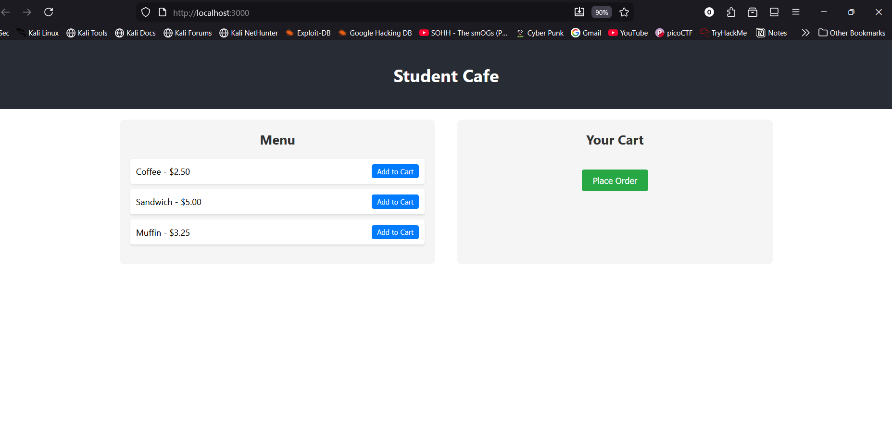
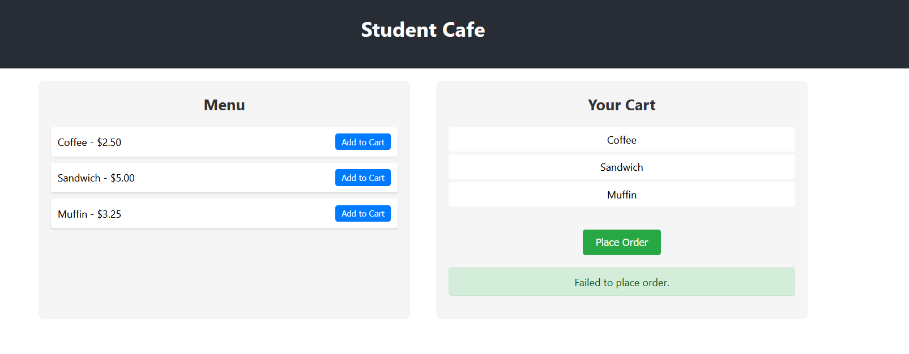
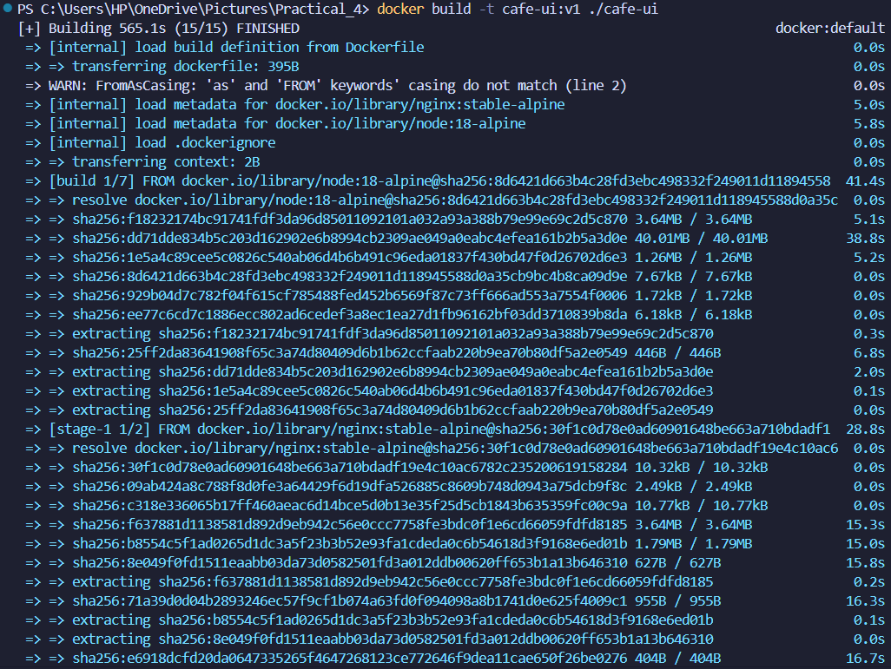
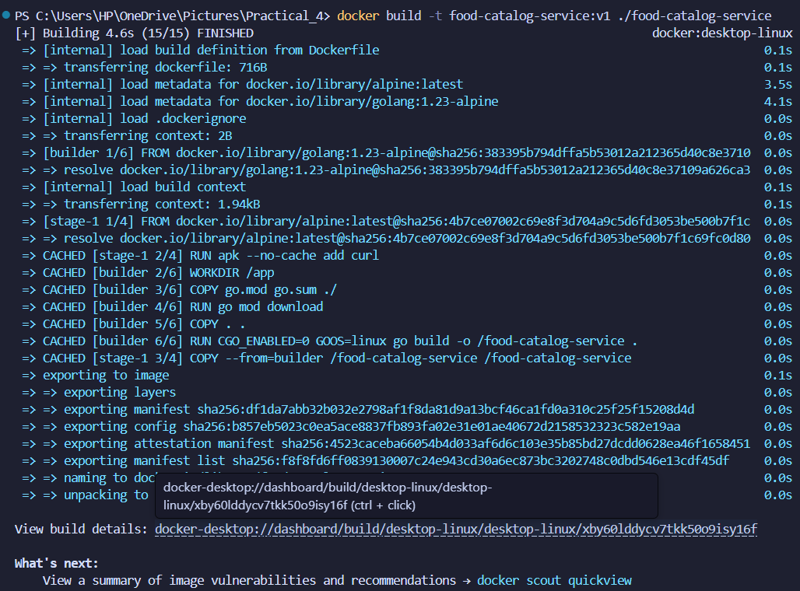
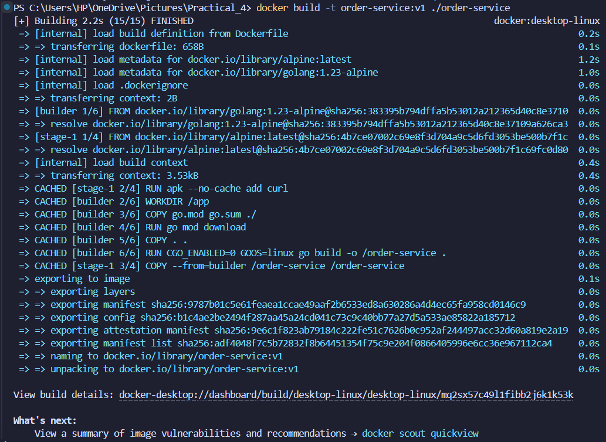
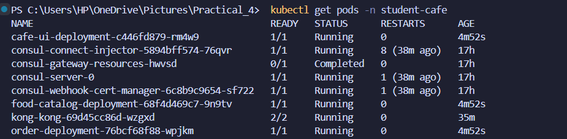
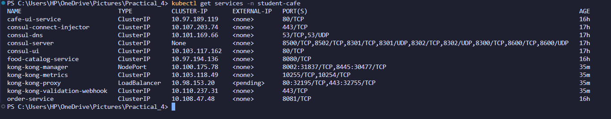
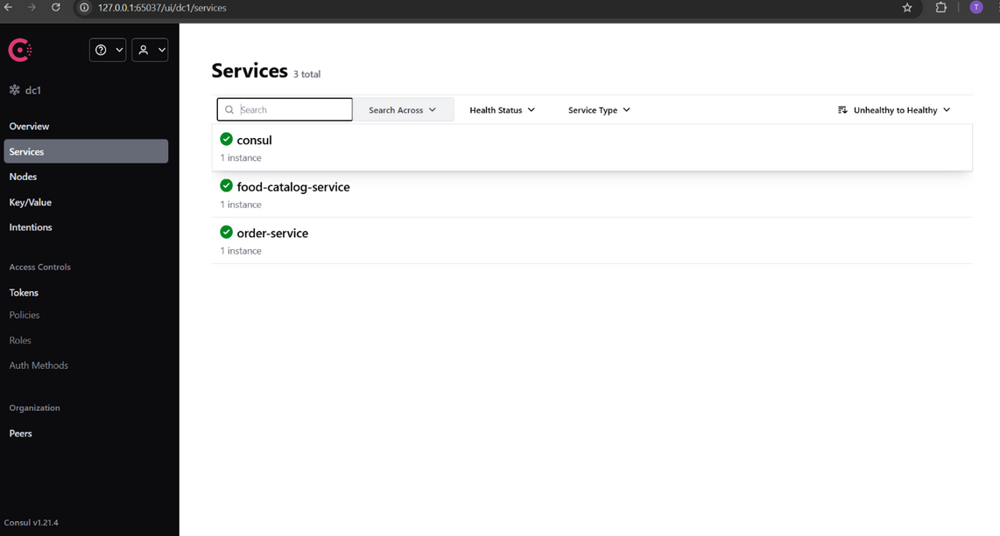

# Student Cafe - Kubernetes Microservices Application

A microservices-based cafe application deployed on Kubernetes with Kong API Gateway for routing and service discovery.

## GitHub Repository
[https://github.com/Rynorbu/WEB303_Practical4-_Kubernetes-Microservices](https://github.com/Rynorbu/WEB303_Practical4-_Kubernetes-Microservices)

## Table of Contents
- [GitHub Repository](#github-repository)
- [Project Overview](#project-overview)
- [Architecture](#architecture)
- [Technologies Used](#technologies-used)
- [Evidence Proof of Work Done](#evedience-proof-of-work-done)
- [Journey](#journey)
- [Challenges I Faced (And How I Solved Them)](#challenges-i-faced-and-how-i-solved-them)
- [API Endpoints](#api-endpoints)
- [What I Learned](#what-i-learned)
- [Conclusion](#conclusion)

---

## Project Overview

This project represents my hands-on experience building and deploying a real-world microservices application using Kubernetes. The goal was to create a functional cafe ordering system where customers can browse a menu and place orders, all while the backend services communicate seamlessly through an API gateway.

The application consists of three main components:
- **Frontend**: A React-based user interface that lets customers view the food menu and place orders in a clean, intuitive way
- **Backend Services**: 
  - Food Catalog Service (written in Go) - this manages all the menu items and their details
  - Order Service (also in Go) - handles the order processing and talks to the catalog service to validate items
- **API Gateway**: Kong Ingress Controller acts as the traffic cop, routing requests to the right services
- **Orchestration**: Kubernetes manages all the containers, ensuring they stay running and can scale when needed
- **Service Discovery**: Optional Consul integration for dynamic service registration and discovery

---

## Architecture

```
┌─────────────────┐
│   React UI      │
│  (cafe-ui)      │
└────────┬────────┘
         │
         ▼
┌─────────────────┐
│  Kong Ingress   │
│   Controller    │
└────────┬────────┘
         │
    ┌────┴─────┬─────────────────┐
    ▼          ▼                 ▼
┌────────┐ ┌──────────┐  ┌──────────────┐
│Cafe UI │ │  Food    │  │    Order     │
│Service │ │ Catalog  │  │   Service    │
│  :80   │ │   :8080  │  │     :8081    │
└────────┘ └──────────┘  └──────────────┘
```

### Service Communication
- **Frontend** → Kong Gateway → Backend Services
- **Order Service** ↔ **Food Catalog Service** (for item validation)
- All services run in the `student-cafe` namespace

---

## Technologies Used

### Frontend
- **React** (v19.1.1) - UI framework
- **React Scripts** - Build tooling
- **Nginx** - Production web server (in Docker)

### Backend
- **Go** (Golang) - Backend services
- **Chi Router** - HTTP routing
- **Consul** - Service discovery (optional)

### DevOps & Infrastructure
- **Docker** - Containerization
- **Kubernetes** - Container orchestration
- **Minikube** - Local Kubernetes cluster
- **Kong** - API Gateway and Ingress Controller
- **kubectl** - Kubernetes CLI

---


## Evedience Proof of Work Done

### 1. React Frontend - Food Menu


**What this shows:**
- The main page customers see when they visit the cafe website
- Menu items displayed with names and prices (Coffee $2.50, Sandwich $5.00, Muffin $3.25)
- Clean and simple user interface for easy browsing
- Users can select items to add to their order

### 2. Successful Order Placement


**What this shows:**
- Order was successfully submitted and processed
- The system confirmed the order was received
- Proves that the frontend talks to the backend correctly
- Shows the complete workflow from UI → Kong → Order Service is working

### 3. Docker Images Built
**Cafe UI Docker Image:**


**Food Catalog Service Docker Image:**


**Order Service Docker Image:**


**What this shows:**
- All three applications are packaged as Docker containers
- Each image is tagged as version 1 (v1)
- Images are ready to be deployed to Kubernetes
- Shows successful containerization of the React app and both Go services

### 4. Kubernetes Pods Running


**What this shows:**
- All three application pods are running successfully
- Status shows "Running" which means no errors
- Each pod has been up and running (shown in the AGE column)
- Kubernetes successfully deployed all containers in the student-cafe namespace

### 5. Kubernetes Services


**What this shows:**
- All three Kubernetes services are created and running
- Each service has a ClusterIP for internal communication
- Services expose the correct ports (80 for UI, 8080 for catalog, 8081 for orders)
- These services allow the pods to communicate with each other inside the cluster

### 6. Consul Service Discovery


**What this shows:**
- Consul dashboard showing registered services (optional feature)
- Services can discover and communicate with each other dynamically
- Provides health checks and monitoring for services
- Alternative to Kubernetes' built-in service discovery

--- 

## Journey

### 1. **Building the Applications**
I started by developing the actual applications before worrying about deployment. For the **frontend**, I built a simple but functional React app that displays menu items in cards and allows users to select items and place orders. The UI needed to be clean and user-friendly, so I focused on making it responsive and easy to navigate.

For the **backend**, I chose Go because of its simplicity and performance. I created two separate microservices:
- The **Food Catalog Service** simply returns a list of menu items with their prices - nothing fancy, just a straightforward REST API
- The **Order Service** was more interesting because it needed to receive orders, validate them by checking with the catalog service, and then return a confirmation. This taught me how microservices communicate with each other.

### 2. **Containerizing Everything**
Once the applications worked locally, I moved on to Docker. This was my first time creating production-ready Dockerfiles, and I learned a lot about multi-stage builds. For the React app, I used one stage to build the application with Node, then copied only the built files to an Nginx container. This dramatically reduced the final image size - pretty cool!

For the Go services, I used `golang:alpine` as the base image to keep things lightweight. The key lesson here was understanding that smaller images mean faster deployments and less storage overhead.

### 3. **Setting Up Kubernetes**
This was the most challenging part for me. I had to create YAML files for deployments and services. At first, I struggled with understanding the difference between Deployments (which manage pods) and Services (which expose them). 

I organized everything in a dedicated `student-cafe` namespace to keep it separate from other Kubernetes resources. One important detail I learned was setting `imagePullPolicy: IfNotPresent` because my images were built locally in Minikube, not pushed to a registry.

### 4. **Configuring the API Gateway**
Kong was completely new to me. The idea of an Ingress Controller routing traffic based on URL paths made sense conceptually, but getting it working was tricky. I configured routes so that:
- Any request to `/` goes to the React UI
- Requests to `/api/catalog` go to the catalog service
- Requests to `/api/orders` go to the order service

The `strip-path` annotation was crucial - without it, my backend services were receiving paths like `/api/catalog/items` instead of just `/items`, which broke everything.

### 5. **Service Discovery Exploration**
I experimented with Consul for service discovery, though this was optional. The idea is that services can register themselves and find other services dynamically. While interesting, I realized that Kubernetes already provides DNS-based service discovery, which was simpler for this use case.

### 6. **Testing the Complete System**
Finally, I tested everything end-to-end. I used `kubectl get pods` and `kubectl get services` to verify all my components were running. Then I accessed the UI through the browser, placed test orders, and watched the requests flow through Kong to the backend services. Seeing it all work together was incredibly satisfying!

---

## Challenges I Faced (And How I Solved Them)

### 1. **The Great Image Pull Mystery**
My first major frustration came when Kubernetes kept saying it couldn't find my Docker images, even though I'd just built them! I spent way too long debugging this before discovering that Minikube uses its own Docker daemon. The solution was simple but not obvious - I had to run `minikube docker-env` and then rebuild my images inside Minikube's environment. Lesson learned: local Docker and Minikube Docker are separate worlds!

### 2. **Kong Routing Headaches**
When I first set up Kong, my backend services were returning 404 errors. After some investigation, I realized Kong was forwarding paths like `/api/catalog/items` to my service, but my Go service only knew about `/items`. The fix was adding the `strip-path: true` annotation, which tells Kong to remove the `/api/catalog` prefix before forwarding. This small detail took me hours to figure out!

### 3. **Services That Couldn't Talk to Each Other**
Getting the Order Service to communicate with the Food Catalog Service was trickier than I expected. At first, I tried using `localhost`, which obviously didn't work because they're in different containers. Then I learned about Kubernetes DNS - I could simply use `food-catalog-service:8080` as the address, and Kubernetes would resolve it automatically. This was a big "aha!" moment for me.

### 4. **The CORS Nightmare**
Initially, my React app was getting CORS errors when trying to call the backend APIs. I started going down the rabbit hole of adding CORS headers to my Go services, but then I realized a smarter solution: route everything through Kong. Since all requests now come from the same origin (through the Ingress), CORS isn't an issue. Sometimes the simple solution is the best one!

### 5. **Namespace Confusion**
I made the mistake of deploying some services in the default namespace and others in `student-cafe`. They couldn't communicate, and I was confused why. Once I understood that Kubernetes isolates namespaces, I moved everything to `student-cafe` and it worked. Pro tip: keep related services in the same namespace unless you have a good reason not to.

### 6. **Bloated Docker Images**
My first React Docker image was over 1GB! That's when I learned about multi-stage builds. By separating the build stage (which needs Node and all the dev dependencies) from the runtime stage (which only needs Nginx and the static files), I got the image down to around 50MB. The build process takes the same time, but deployments are much faster.

---

## API Endpoints

### Food Catalog Service (Port 8080)
- `GET /items` - Retrieve all food items
- `GET /health` - Health check endpoint

### Order Service (Port 8081)
- `POST /orders` - Create a new order
  ```json
  {
    "item_ids": ["1", "2"]
  }
  ```
- `GET /health` - Health check endpoint

### Through Kong Gateway
- `GET /api/catalog/items` - Get food menu
- `POST /api/orders` - Place an order
- `GET /` - Access the React UI

---


## What I Learned

This project was a massive learning experience for me. Here are the key takeaways:

### Technical Skills
**Microservices Architecture**: Before this project, I understood microservices conceptually, but actually building them helped me see why they're powerful. Having separate services means I can update the order processing logic without touching the catalog, scale them independently, and use different technologies for each if needed.

**Containerization with Docker**: I learned that Docker isn't just about packaging apps - it's about creating reproducible, portable environments. Multi-stage builds, image optimization, and understanding layers changed how I think about deployments. Every line in a Dockerfile matters for the final image size.

**Kubernetes Orchestration**: This was probably the biggest learning curve. Kubernetes has so many concepts - Pods, Deployments, Services, Ingress, Namespaces - and understanding how they all fit together took time. But now I appreciate how Kubernetes handles scaling, self-healing, and service discovery automatically. It's like having an operations team built into your infrastructure.

**API Gateway Patterns**: Kong taught me why API gateways are essential in microservices. Instead of every client needing to know about multiple service endpoints, Kong provides a single entry point. It also handles cross-cutting concerns like routing, authentication (which I could add later), and rate limiting.

**Service-to-Service Communication**: Understanding how services discover and talk to each other in a distributed system was eye-opening. Kubernetes' built-in DNS, service names as hostnames, and the importance of health checks all came together to create a resilient system.

### Problem-Solving Skills
I learned to debug distributed systems, which is very different from debugging a monolithic application. When something breaks, it could be the container, the Kubernetes configuration, the networking, or the application code. I got better at:
- Reading logs from multiple sources (`kubectl logs`, Docker logs)
- Using `kubectl describe` to understand why pods aren't starting
- Testing services individually before integrating them
- Breaking down complex problems into smaller, testable pieces

### DevOps Mindset
This project showed me why DevOps practices matter. Version control for infrastructure (my YAML files), documentation, and having reproducible builds aren't just nice-to-haves - they're essential. When something breaks, being able to tear everything down and rebuild from scratch is incredibly valuable.

### What Surprised Me
I was surprised by how much thought goes into naming things and organizing resources. Choosing good service names, organizing files, and using clear labels in Kubernetes makes maintenance so much easier. I was also surprised by how powerful declarative configuration is - describing what I want (in YAML) rather than how to create it (in scripts) feels more robust.

---

## Conclusion

Completing this Student Cafe microservices project has been both challenging and rewarding. What started as a seemingly simple task - building a cafe ordering system - turned into a comprehensive journey through modern cloud-native development practices.

I'm proud of what I've built here: a fully functional, containerized microservices application running on Kubernetes with proper API gateway routing. More importantly, I've gained practical experience with technologies that are fundamental to how modern software is built and deployed at scale.

The challenges I encountered - from Docker image issues to CORS problems to Kong routing configuration - weren't just obstacles; they were valuable learning opportunities. Each problem I solved deepened my understanding of how distributed systems work and how the different pieces fit together.

If I were to continue this project, I'd love to add features like user authentication, persistent storage with a database, monitoring with Prometheus and Grafana, and set up a proper CI/CD pipeline with GitHub Actions. But for now, I'm satisfied with having built a solid foundation that demonstrates the core concepts of microservices architecture.

This practical has shown me that modern software development is as much about infrastructure and orchestration as it is about writing code. The ability to containerize applications, deploy them to Kubernetes, and manage them at scale is an invaluable skill set that I'm excited to continue developing.

Thank you for reviewing my work. I hope this documentation clearly demonstrates my understanding of the concepts and my ability to apply them to build real-world applications.

