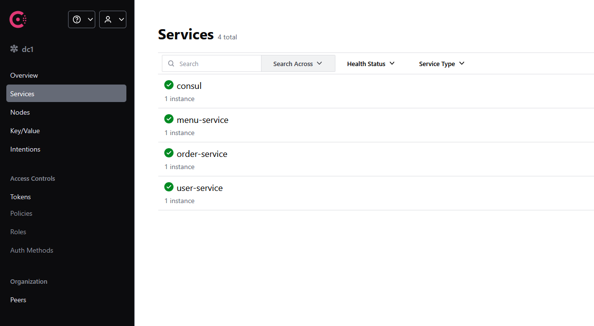
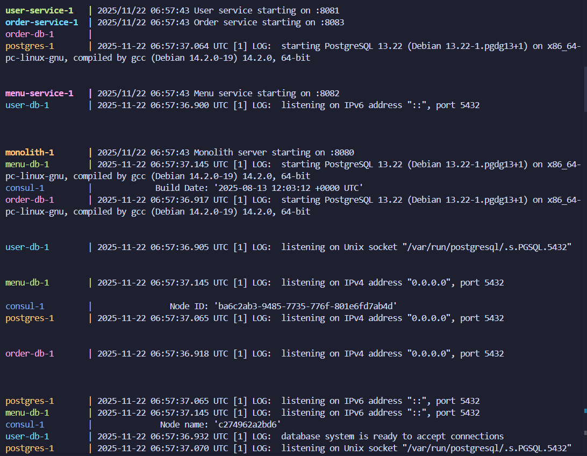
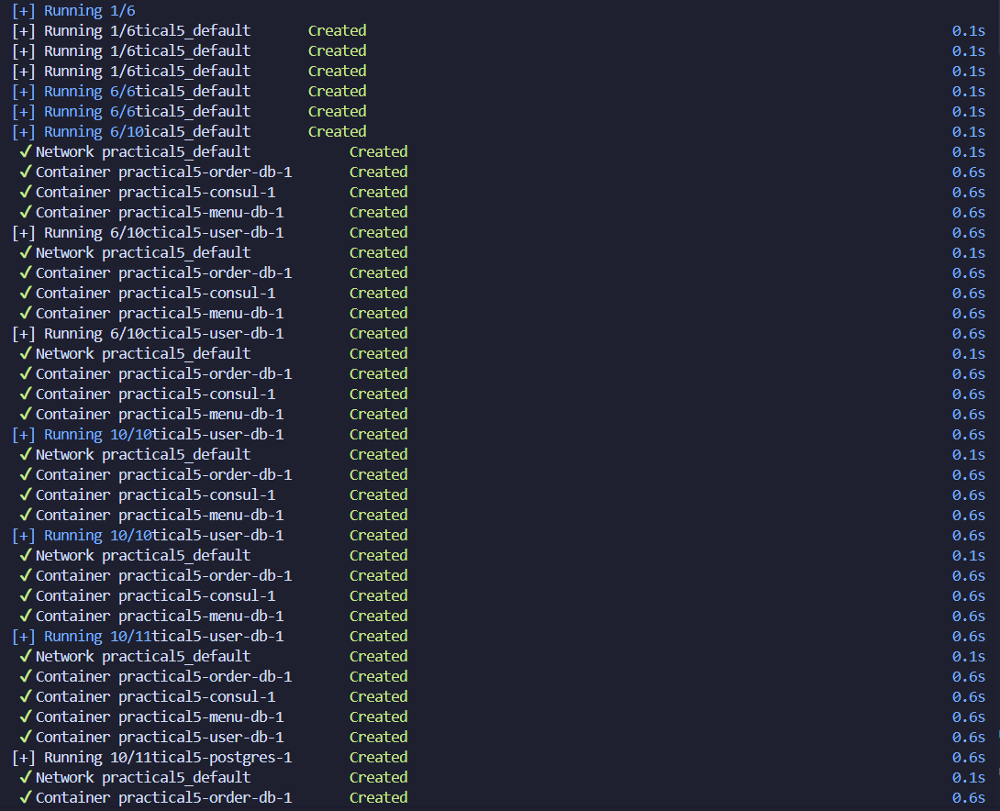
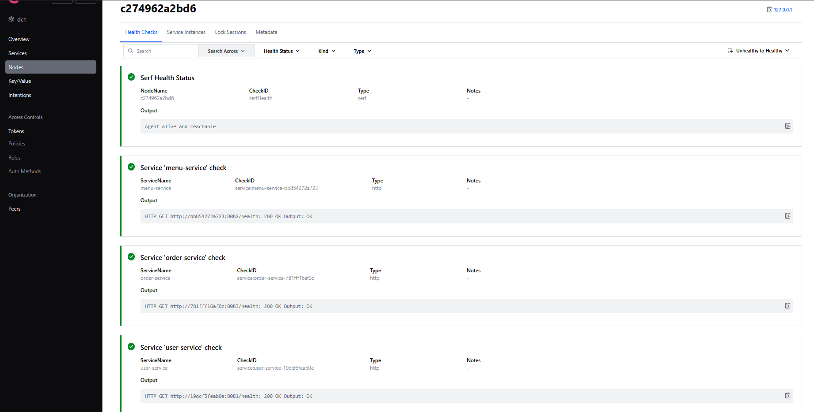
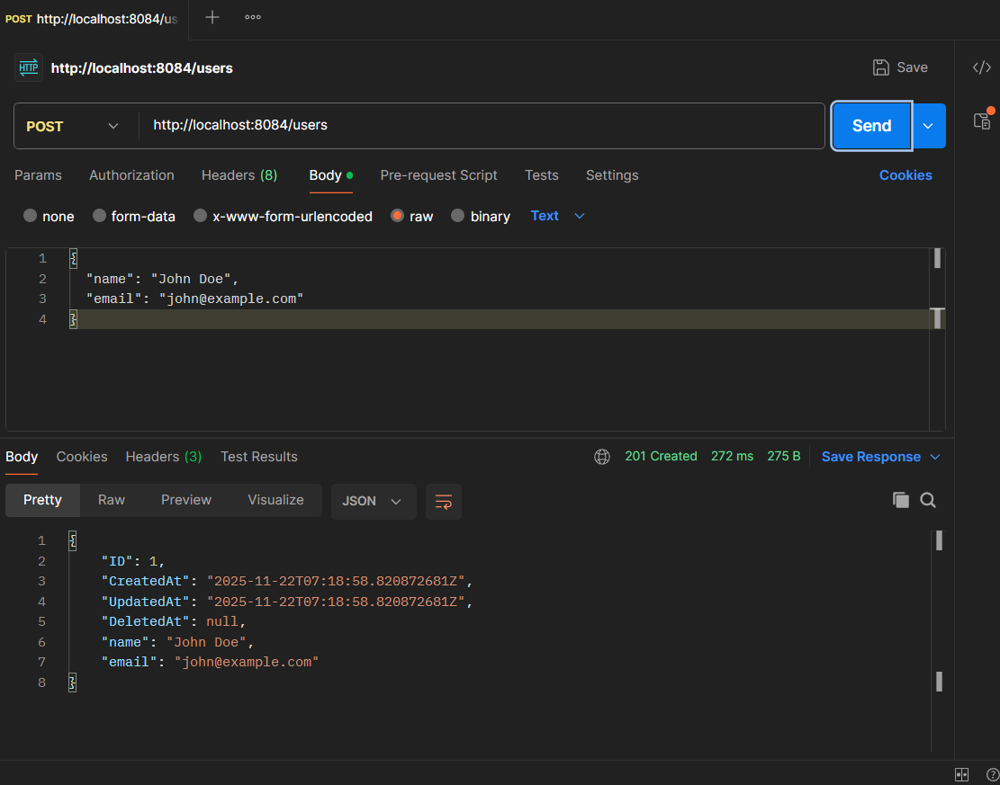
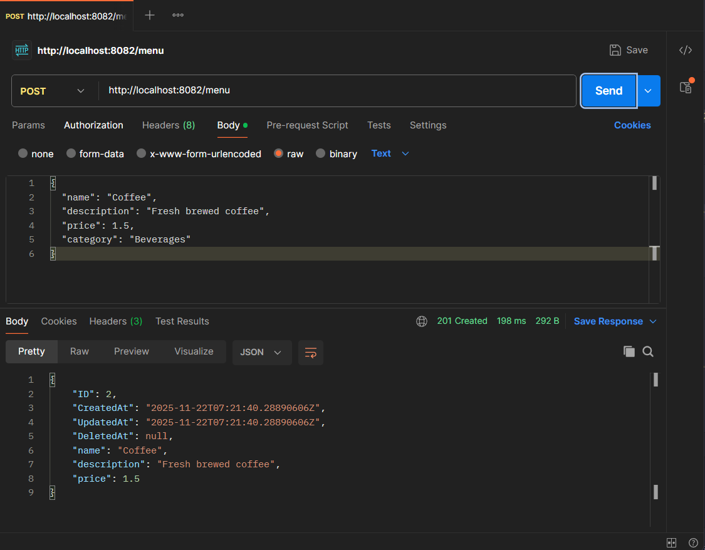
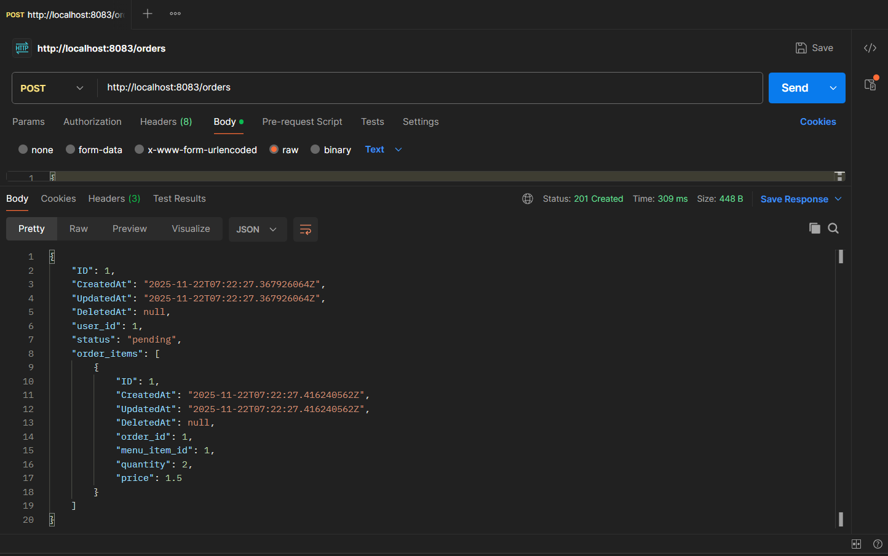
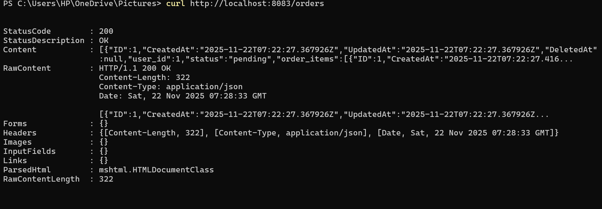
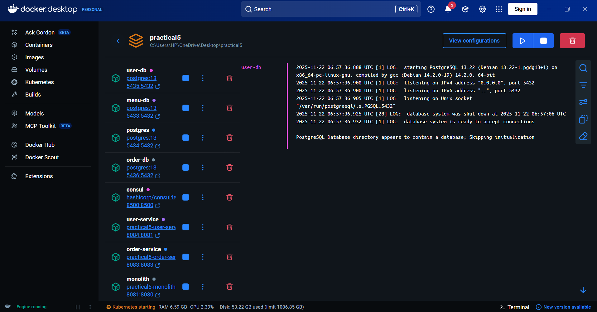

# Practical 5: Refactoring a Monolithic Web Server to Microservices

**Student Name:** Ranjung Yeshi Norbu 

**Course:** WEB303 - Microservices & Serverless Applications  
**Date:** October 15, 2025

**GitHub Repository:** https://github.com/Rynorbu/Refactoring_a_Monolithic_Web_Server_to_Microservices

---

## Table of Contents
1. [Project Overview](#project-overview)
2. [Architecture Diagram](#architecture-diagram)
3. [Service Boundaries Justification](#service-boundaries-justification)
4. [Implementation Details](#implementation-details)
5. [Challenges Encountered](#challenges-encountered)
6. [Setup and Running Instructions](#setup-and-running-instructions)
7. [Testing Guide](#testing-guide)
8. [Reflection Essay](#reflection-essay)
9. [Screenshots](#screenshots)
10. [Conclusion](#conclusion)

---

## Project Overview

This practical demonstrates the systematic refactoring of a monolithic Student Cafe application into a microservices architecture. The project showcases:

- **Domain-Driven Design** principles for identifying service boundaries
- **Database-per-service** pattern implementation
- **Inter-service communication** via REST APIs
- **Service Discovery** using HashiCorp Consul
- **API Gateway** pattern for unified client access
- **Container orchestration** with Docker Compose

### Services Implemented

| Service | Port | Database | Responsibility |
|---------|------|----------|----------------|
| **Monolith** | 8081 | student_cafe (PostgreSQL) | Baseline monolithic application |
| **User Service** | 8084 | user_db (PostgreSQL) | User management and authentication |
| **Menu Service** | 8082 | menu_db (PostgreSQL) | Food catalog management |
| **Order Service** | 8083 | order_db (PostgreSQL) | Order processing and management |
| **API Gateway** | 8080 | N/A | Request routing and unified API |
| **Consul** | 8500 | N/A | Service discovery and health checks |

---

## Architecture Diagram

```
                                    ┌─────────────────┐
                                    │   API Gateway   │
                                    │   (Port 8080)   │
                                    └────────┬────────┘
                                             │
                    ┌────────────────────────┼──────────────────────┐
                    │                        │                      │
            ┌───────▼────────┐      ┌───────▼────────┐      ┌───────▼────────┐
            │  User Service  │      │  Menu Service  │      │ Order Service  │
            │   (Port 8084)  │      │   (Port 8082)  │      │   (Port 8083)  │
            └───────┬────────┘      └───────┬────────┘      └───────┬────────┘
                    │                       │                       │
            ┌───────▼────────┐      ┌───────▼────────┐      ┌───────▼────────┐
            │    user_db     │      │    menu_db     │      │   order_db     │
            │  (Port 5435)   │      │  (Port 5433)   │      │  (Port 5436)   │
            └────────────────┘      └────────────────┘      └────────────────┘

                    ┌─────────────────────────────────────┐
                    │      Consul (Service Discovery)     │
                    │           (Port 8500)               │
                    └─────────────────────────────────────┘

                    ┌─────────────────────────────────────┐
                    │        Monolith (Baseline)          │
                    │   Port 8081 → student_cafe DB       │
                    └─────────────────────────────────────┘
```

### Communication Flow
1. **Client → API Gateway** (Port 8080)
2. **API Gateway → Consul** (Service Discovery)
3. **API Gateway → Microservices** (Based on discovered addresses)
4. **Order Service → User/Menu Services** (Inter-service communication via Consul)
5. **Each Service → Its Database** (Database-per-service pattern)

---

## Service Boundaries Justification

### Why This Split Makes Sense

#### 1. **User Service** (User Context - Bounded Context)
- **Entities:** User (identified by user_id)
- **Business Capability:** User registration, profile management
- **Changes When:** User profile requirements evolve
- **Scales When:** High user registration/login traffic
- **Independence:** User data is completely independent of menu items and orders
- **Low Coupling:** Other services only need to validate user existence via user_id

#### 2. **Menu Service** (Menu Context - Bounded Context)
- **Entities:** MenuItem (identified by menu_item_id)
- **Business Capability:** Food catalog management, pricing updates
- **Changes When:** Menu items added/removed, prices updated
- **Scales When:** Heavy browsing during peak hours (lunch/dinner)
- **Independence:** Menu can be browsed without creating orders
- **High Cohesion:** Menu items and pricing always change together

#### 3. **Order Service** (Order Context - Bounded Context)
- **Entities:** Order, OrderItem (aggregates)
- **Business Capability:** Order creation, order tracking, order history
- **Changes When:** Order workflow changes (delivery, payment integration)
- **Scales When:** Order rush periods (lunch hours)
- **Dependencies:** References users and menu items but doesn't own them
- **Inter-service Communication:** Validates user_id and menu_item_id via HTTP calls

### Domain-Driven Design Principles Applied

1. **Bounded Contexts:** Each service represents a distinct business domain
2. **High Cohesion:** Related data and operations are grouped together
3. **Low Coupling:** Services communicate via well-defined APIs
4. **Aggregates:** Order service owns Order + OrderItems as a unit
5. **Business Capabilities:** Each service maps to a clear business function

---

## Implementation Details

### Technology Stack
- **Language:** Go 1.23
- **Web Framework:** Chi Router v5
- **ORM:** GORM
- **Database:** PostgreSQL 13
- **Service Discovery:** HashiCorp Consul
- **Containerization:** Docker & Docker Compose

### Key Design Decisions

#### Database-per-Service Pattern
Each microservice has its own PostgreSQL database:
- **Advantage:** Service independence, schema evolution, technology heterogeneity
- **Trade-off:** No cross-service transactions, eventual consistency required

#### Price Snapshotting in Orders
Order service stores menu item prices at order time:
```go
orderItem := models.OrderItem{
    MenuItemID: item.MenuItemID,
    Quantity:   item.Quantity,
    Price:      menuItem.Price, // Historical snapshot
}
```
**Rationale:** Historical orders shouldn't change when menu prices update

#### Consul-based Service Discovery
Services register themselves with Consul on startup:
```go
registration := &consulapi.AgentServiceRegistration{
    ID:      fmt.Sprintf("%s-%s", serviceName, hostname),
    Name:    serviceName,
    Port:    port,
    Address: hostname,
    Check: &consulapi.AgentServiceCheck{
        HTTP:     fmt.Sprintf("http://%s:%d/health", hostname, port),
        Interval: "10s",
        Timeout:  "3s",
    },
}
```
**Benefits:** Dynamic discovery, health checking, resilience

---

## Challenges Encountered

Building this microservices architecture wasn't a smooth, linear process. I encountered several roadblocks that forced me to rethink my approach and dig deeper into distributed systems concepts. Here's what I learned the hard way:

### Challenge 1: Getting Services to Talk to Each Other

When I first tried to make the Order Service validate users, I did what seemed obvious, hardcoded the URL as `http://user-service:8081`. It worked in my local Docker network, so I thought I was done. But then I started thinking: what happens when user-service moves to a different port? What if there are multiple instances for load balancing? My hardcoded approach would break immediately.

That's when I dove into Consul for service discovery. The learning curve was steep, understanding service registration, health checks, and DNS-based discovery took time. But once I got it working, it felt like magic. Services could now find each other dynamically, and if one instance went down, Consul would route traffic to healthy ones. This challenge taught me that in distributed systems, nothing should be static. Everything needs to be discoverable and resilient.

### Challenge 2: The Database Isolation Dilemma

Coming from a monolithic background where you can just JOIN tables across the entire database, the microservices approach felt restrictive. The Order Service needed to verify that a user exists before creating an order, but it couldn't directly query the user database. My first reaction was, "Why are we making this so complicated?"

I had to make HTTP calls to the User Service just to check if a user_id was valid. This meant network latency, potential failures, and more complexity. I seriously considered just sharing the database, it would be so much simpler! But as I researched more, I realized that database-per-service is what gives microservices their independence. If I shared the database, I'd have a distributed monolith, all the complexity of microservices with none of the benefits.

So I accepted the trade-off. Yes, there's latency. Yes, it's more complex. But the Order Service can now evolve independently, we can scale databases separately, and one service's database issues won't cascade to others. I also learned about eventual consistency patterns and caching strategies that could mitigate the performance impact in a production system.

### Challenge 3: The "Race Condition" of Service Startup

This one was frustrating. I'd run `docker-compose up`, watch the logs scroll by, and then see errors: "connection refused," "database does not exist," "panic: runtime error." What was happening? My services were starting before their databases were ready to accept connections.

I initially tried using Docker Compose's `depends_on`, thinking it would solve everything. Nope. `depends_on` only waits for the container to start, not for PostgreSQL to actually be ready to accept connections. So I added retry logic in my Go code, if the database connection fails, wait a second and try again. This helped, but it felt hacky.

The real solution was implementing proper health check endpoints (`/health`) that Consul could monitor. Combined with connection retry logic and strategic use of `depends_on`, services now start gracefully. This taught me that in distributed systems, you can't assume anything is ready when you need it, you have to build resilience into every component.

### Challenge 4: The Mysterious Go Module Checksum Errors

This one had me scratching my head for a while. I'd try to build a service, and Docker would throw cryptic errors about checksum mismatches in `go.sum`. I tried rebuilding, clearing caches, nothing worked. The builds that worked yesterday were suddenly failing.

After some research, I learned that Go modules maintain checksums to ensure dependency integrity. When I updated a dependency or changed Go versions, the `go.sum` file could get out of sync. The fix was simple but not obvious: delete `go.sum` and regenerate it with `go mod tidy`. I had to do this for each service individually.

This taught me the importance of dependency management and reproducible builds. Now I make it a habit to run `go mod tidy` after any dependency change and commit the updated `go.sum` file. It's one of those small practices that saves hours of debugging later.

### Challenge 5: Port Conflicts Everywhere

When I first set up multiple PostgreSQL databases, I naively tried to expose them all on port 5432. Docker immediately complained—"port already in use." Of course it was; I was trying to run four PostgreSQL instances on the same port!

The solution was understanding Docker's port mapping. Each container could internally use port 5432 (the PostgreSQL default), but I needed to map them to different host ports. So I created a mapping scheme:
- Menu DB: `5433:5432`
- User DB: `5435:5432`  
- Order DB: `5436:5432`
- Monolith DB: `5434:5432`

```yaml
user-db:
  ports:
    - "5435:5432"  # Host:Container
```

This way, each database is accessible on a unique host port, but internally they all run on their familiar port 5432. It seems obvious now, but at the time it was a valuable lesson in how containerization handles networking. I also learned to keep track of my port assignments in documentation, when you're managing 10+ containers, it's easy to lose track.

### What These Challenges Taught Me

Every challenge pushed me to understand distributed systems more deeply. I learned that microservices aren't just about splitting code, they're about embracing uncertainty, building for failure, and accepting complexity in exchange for flexibility. The frustrations were real, but working through them gave me practical skills that I couldn't have gained from just reading documentation.

---

## Reflection Essay: Monolith to Microservices Migration


### Monolith vs Microservices Comparison

### Monolithic Architecture: The Starting Point

In the context of the Student Cafe application, the monolithic architecture initially offered simplicity and rapid development. All functionality, user management, menu operations, and order processing, resided within a single codebase, sharing a unified database.

**Advantages of the Monolith:**
- **Transactional Consistency**: All operations occurred within a single database, ensuring ACID compliance
- **Straightforward Deployment**: Single deployment unit simplified the release process
- **Minimal Operational Overhead**: One application to monitor, debug, and maintain
- **Sufficient for Small Scale**: For a small-scale cafe system with limited traffic, the monolith proved maintainable

### Microservices Architecture: The Evolution

The microservices architecture introduced significant advantages that align with scalability and team dynamics. By decomposing the system into user-service, menu-service, and order-service, each component gained independence.

**Advantages of Microservices:**
- **Independent Scaling**: The menu-service, which experiences high read traffic during meal times, can scale independently without affecting user authentication or order processing
- **Technology Diversity**: Different services can use different technologies optimized for their specific needs
- **Team Autonomy**: Separate teams can work on distinct services without coordination overhead
- **Fault Isolation**: Failures in one service don't necessarily cascade to others
- **Faster Deployment Cycles**: Services can be deployed independently, reducing deployment risk

**The Role of API Gateway:**
The API gateway acts as a single entry point, abstracting the complexity of multiple services from clients while providing centralized authentication, routing, and cross-cutting concerns.

---

## Database-Per-Service Pattern Trade-offs

### The Pattern Explained

The database-per-service pattern embodies the microservices philosophy of loose coupling and service autonomy. Each service—user, menu, and order—maintains its own database schema and data, ensuring that no service directly accesses another's database.

### Benefits

| Benefit | Description |
|---------|-------------|
| **Technology Flexibility** | Services can choose optimal database technologies (SQL, NoSQL, graph databases) for their specific needs |
| **Schema Independence** | Schema changes remain localized and don't affect other services |
| **Independent Scaling** | Databases can scale independently based on their data requirements |
| **Service Autonomy** | Teams have full control over their data models without coordination |
| **Fault Isolation** | Database failures are contained to individual services |

### Trade-offs and Challenges

| Challenge | Impact |
|-----------|--------|
| **Data Consistency** | Traditional ACID transactions cannot span multiple databases; eventual consistency becomes the norm |
| **No Cross-Database Joins** | Aggregating data requires multiple service calls or implementing Backend for Frontend patterns |
| **Data Duplication** | Services may need to cache data from other services (e.g., order-service caching user names) |
| **Complex Reporting** | Analytics become more complex when data is distributed, often requiring data warehouses |
| **Increased Network Calls** | Operations that were single queries now require multiple network round-trips |

In the Student Cafe system, creating an order involves data from multiple services, requiring careful orchestration and consideration of these trade-offs.

---

## When NOT to Split a Monolith

Despite the appeal of microservices, maintaining a monolithic architecture is often the prudent choice in several scenarios:

### 1. Small Teams and Startups

**Rationale**: The operational complexity of managing multiple services, deployment pipelines, and distributed systems can overwhelm the benefits. A monolith offers faster iteration and simpler debugging when building an MVP or validating product-market fit.

### 2. Tightly Coupled Business Logic

**Rationale**: Applications that require frequent cross-domain transactions should remain monolithic. If nearly every user operation requires coordinating between services, the network overhead and distributed transaction complexity outweigh the benefits of separation.

**Example**: In the Student Cafe system, simple cafes with straightforward operations might not justify the microservices overhead, while multi-location franchises or institutions with high traffic would benefit significantly.

### 3. Lack of Distributed Systems Expertise

**Rationale**: When the team lacks experience with distributed systems, service mesh technologies, and DevOps practices, prematurely adopting microservices can lead to a "distributed monolith" that combines the worst aspects of both architectures.

### 4. Immature DevOps Practices

**Requirements Before Splitting**:
- Automated CI/CD pipelines
- Container orchestration (Kubernetes, Docker Swarm)
- Comprehensive monitoring and observability
- Incident response procedures
- Service mesh or API gateway infrastructure

### 5. Clear Business Domain Boundaries Don't Exist

**Rationale**: Microservices should align with business domain boundaries. If these boundaries are unclear or constantly shifting, premature splitting creates unnecessary complexity.

---

## User ID Validation Without Direct Database Access

### The Challenge

The order-service faces a critical challenge: validating that a user_id exists without direct database access to the user-service's database. This exemplifies the communication patterns necessary in microservices.

### Solution Approaches

#### 1. Synchronous HTTP Validation

**Implementation**: Order-service queries the user-service API endpoint (e.g., `GET /users/{user_id}`) before creating an order.

**Pros**:
- Strong consistency
- Simple to implement
- Real-time validation

**Cons**:
- Adds latency to order creation
- Creates tight coupling between services
- Failure in user-service blocks order creation

#### 2. Event-Driven Caching

**Implementation**: User-service publishes events when users are created or deleted, and order-service maintains a local cache of valid user IDs.

**Pros**:
- Low latency during order creation
- Order-service can function independently
- Reduces load on user-service

**Cons**:
- Eventual consistency challenges
- Cache synchronization complexity
- Storage overhead in order-service

#### 3. API Gateway Authentication (Current Approach)

**Implementation**: The API gateway handles authentication, ensuring that only valid, authenticated users can create orders, implicitly validating the user_id through JWT tokens or session management.

**Pros**:
- Centralized security
- Leverages existing authentication infrastructure
- No additional validation calls needed

**Cons**:
- Relies on gateway for critical validation
- Token expiration considerations

#### 4. Hybrid Approach (Recommended)

Combine lightweight validation calls with caching and TTL (time-to-live) to balance consistency with performance. Cache successful validations for a short period (e.g., 5 minutes) and invalidate on user deletion events.

---

## Handling Menu Service Downtime

### The Problem

When the menu-service becomes unavailable during order creation, the system's resilience mechanisms determine the user experience. Without proper fault tolerance, order-service would fail with timeout errors.

### Resilience Strategies

#### 1. Circuit Breaker Pattern

**Implementation**: Detect menu-service unavailability and quickly return errors rather than waiting for timeouts.

**States**:
- **Closed**: Normal operation, requests pass through
- **Open**: Service detected as down, requests fail immediately
- **Half-Open**: Periodic retry to check if service recovered

**Benefits**: Prevents cascading failures and resource exhaustion

#### 2. Local Caching

**Implementation**: Cache menu data within order-service to provide a buffer against temporary outages.

**Approach**:
- Populate cache periodically or on-demand
- Set appropriate TTL values (e.g., 10-15 minutes for menu items)
- Accept eventual consistency trade-off

**Risks**:
- Accepting orders for out-of-stock items
- Price discrepancies if menu updates during outage

#### 3. Retry Logic with Exponential Backoff

**Implementation**: Automatically retry failed requests with increasing delays.

**Pattern**:
```
Attempt 1: Immediate
Attempt 2: Wait 1 second
Attempt 3: Wait 2 seconds
Attempt 4: Wait 4 seconds
Give up after max attempts
```

**Benefits**: Recovers from transient failures without overwhelming the recovering service

#### 4. Asynchronous Queue-Based Processing

**Implementation**: Queue orders when menu-service is down and process them when it recovers.

**Considerations**:
- Changes user experience from synchronous to asynchronous confirmation
- Requires message queue infrastructure (RabbitMQ, Kafka)
- Need to handle long-term failures

#### 5. Graceful Degradation

**Implementation**: API gateway returns cached menu data or limited functionality rather than complete failure.

**Example**: Allow orders for previously ordered items or popular menu items even if full menu unavailable

#### 6. Monitoring and Alerting

**Essential Components**:
- Real-time service health monitoring
- Automated alerts to operations teams
- Service level objective (SLO) tracking
- Automated incident creation

---

## Caching Strategies for Performance

### Multi-Layer Caching Architecture

Caching strategies can dramatically improve microservices performance while reducing load on databases and service instances.

#### Layer 1: Client-Side Caching

**Implementation**: Browser cache and HTTP cache headers

**Use Cases**:
- Static assets (images, CSS, JavaScript)
- Menu images and cafe branding
- Public menu data with appropriate cache-control headers

**Benefits**: Zero server load for cached requests

#### Layer 2: CDN (Content Delivery Network)

**Implementation**: CloudFlare, AWS CloudFront, or similar

**Use Cases**:
- Food images and static menu content
- Geographic distribution for faster access

**Benefits**: Reduced latency for geographically distributed users

#### Layer 3: API Gateway Cache

**Implementation**: Response caching at the gateway level

**Use Cases**:
- Public endpoints like menu listings
- Frequently accessed, rarely changing data

**Configuration**:
```
Cache-Control: public, max-age=300  // 5 minutes for menu
Cache-Control: private, max-age=60  // 1 minute for user-specific data
```

**Benefits**: Serves repeated requests without hitting backend services

#### Layer 4: Service-Level Cache (Redis/Memcached)

**Implementation**: In-memory data stores for each service

**Use Cases for Menu-Service**:
- Complete menu listings
- Individual menu items
- Category-based queries

**Use Cases for User-Service**:
- User profiles
- Authentication results
- User preferences

**Use Cases for Order-Service**:
- Recent orders for repeat order feature
- Cached menu item details during order creation

**Benefits**: Dramatically reduced database queries

#### Layer 5: Database Query Cache

**Implementation**: Database-level result caching

**Use Cases**:
- Complex aggregation queries
- Frequently executed read queries

**Benefits**: Reduced database CPU and I/O

### Cache Invalidation Strategies

#### Time-Based Expiration (TTL)

**Approach**: Set expiration times based on data volatility

**Examples**:
- Menu items: 15-30 minutes (change infrequently)
- User sessions: 1 hour
- Order history: 5 minutes

#### Event-Driven Invalidation

**Approach**: Publish cache invalidation events when data changes

**Implementation**:
```
When menu item updated:
  1. Update database
  2. Publish "menu.item.updated" event
  3. All cache layers invalidate that item
```

**Benefits**: Maintains data freshness while maximizing cache hits

#### Write-Through Cache

**Approach**: Update cache and database simultaneously

**Benefits**: Cache always has latest data

#### Cache-Aside (Lazy Loading)

**Approach**: Check cache first, load from database on miss, then populate cache

**Benefits**: Only caches actually requested data

### Monitoring Cache Performance

**Key Metrics**:
- Cache hit ratio (target: >80%)
- Cache miss latency
- Memory usage
- Eviction rate
- Stale data incidents

---

## Conclusion

The migration from monolith to microservices for the Student Cafe system illustrates the nuanced decision-making required in modern software architecture. This reflection has explored six critical dimensions:

1. **Architectural Comparison**: While microservices offer scalability, independence, and technological flexibility, they introduce operational complexity and distributed system challenges that may not suit all scenarios.

2. **Data Management**: The database-per-service pattern exemplifies the trade-off between service autonomy and data consistency, requiring careful consideration of reporting needs and transaction boundaries.

3. **Strategic Restraint**: Recognizing when NOT to split a monolith is as important as knowing when to do so, particularly for small teams, tightly coupled domains, or organizations lacking distributed systems maturity.

4. **Inter-Service Communication**: Validating data across service boundaries requires thoughtful implementation, balancing consistency requirements with performance considerations through synchronous calls, event-driven caching, or gateway-based validation.

5. **Resilience Engineering**: Handling service failures through circuit breakers, caching, retry logic, and graceful degradation transforms a fragile distributed system into a resilient one capable of maintaining service during partial outages.

6. **Performance Optimization**: Multi-layer caching strategies, from browser to database level, can dramatically improve performance while reducing infrastructure costs, though they require careful invalidation strategies and monitoring.

Success in microservices depends not only on technical implementation but also on organizational readiness, clear service boundaries, robust inter-service communication, comprehensive fault tolerance, and strategic performance optimization. The choice between monolith and microservices is not binary but contextual, depending on team size, system scale, business requirements, and operational capabilities. For the Student Cafe system, the microservices architecture provides a foundation for growth while teaching valuable lessons about distributed systems design and operation.

---


## Screenshots

### 1. Consul UI - Service Discovery & Health Checks
**Consul Dashboard showing all microservices registered and healthy:**



*This screenshot demonstrates:*
- All microservices successfully registered with Consul
- Health checks passing (green status)
- Service discovery mechanism working properly
- Each service's instance count and health status visible

---

### 2. Docker Compose - All Services Running
**Docker containers successfully built and running:**





*These screenshots show:*
- All microservices starting successfully
- Database connections established
- Services registering with Consul
- No port conflicts or startup errors

---

### 3. Docker PS - Container Status
**All containers running and healthy:**


*This screenshot confirms:*
- 10+ containers running simultaneously
- User Service (port 8084)
- Menu Service (port 8082)
- Order Service (port 8083)
- API Gateway (port 8080)
- Consul (port 8500)
- Multiple PostgreSQL databases (ports 5433-5436)

---

### 4. Health Check Endpoint
**Service health endpoints responding:**



*This demonstrates:*
- `/health` endpoints implemented for all services
- Consul using these endpoints for health monitoring
- Services reporting healthy status
- Readiness checks working properly

---

### 5. Postman API Testing

#### Creating a User (User Service)


*Test Result:*
-  POST request to `/api/users` successful
-  User created with ID, name, and email
-  API Gateway routing to user-service working
-  Database persistence confirmed

#### Creating Menu Items (Menu Service)


*Test Result:*
-  POST request to `/api/menu` successful
-  Menu items created with name, description, and price
-  API Gateway routing to menu-service working
-  Menu database storing items correctly

#### Creating Orders (Order Service with Inter-Service Communication)


*Test Result:*
-  POST request to `/api/orders` successful
-  Order service validated `user_id` via HTTP call to user-service
-  Order service fetched menu item prices from menu-service
-  Order created with snapshotted prices
-  Inter-service communication working via Consul discovery

#### Order Creation Output (Console Logs)


*This shows:*
- Order service discovering user-service via Consul
- HTTP validation of user existence
- Order service discovering menu-service via Consul
- Fetching menu item details for price snapshotting
- Successful order creation with all validations passed

---

### 6. Docker Networking
**Docker networks enabling service communication:**



*This screenshot demonstrates:*
- Custom bridge network for microservices
- Service-to-service communication via container names
- Database isolation on the same network
- Consul accessible to all services

---

## Conclusion

Working through this practical has been an eye-opening journey into the world of microservices architecture. What started as a simple monolithic Student Cafe application transformed into a distributed system with multiple services, databases, and orchestration layers.

The refactoring process taught me that breaking down a monolith isn't just about splitting code into smaller pieces. It requires careful thought about domain boundaries, communication patterns, and operational complexity. Deciding where to draw the lines between services meant understanding the business domain deeply, recognizing that users, menu items, and orders represent distinct bounded contexts that naturally deserve their own services.

One of the biggest challenges was wrapping my head around the database-per-service pattern. Initially, it felt wrong not being able to join tables across services. But as I implemented inter-service communication through HTTP calls and Consul discovery, I realized this constraint actually forces better design. The Order Service doesn't need to know the internal structure of the User database, it just needs to know whether a user exists. This separation of concerns is powerful.

Getting everything to work together was definitely challenging. There were moments of frustration when services couldn't find each other, databases weren't ready, or port conflicts caused startup failures. But each problem solved deepened my understanding of distributed systems. Learning to use Consul for service discovery felt like unlocking a superpower, no more hardcoded URLs, just dynamic lookup of healthy service instances.

The testing phase was particularly satisfying. Watching Postman requests flow through the API Gateway, get routed to the right microservice via Consul, validate data across service boundaries, and return successful responses felt like conducting an orchestra. Each service played its part perfectly, and the Docker logs showed the beautiful dance of inter-service communication happening in real-time.

### Testing Summary

| Test Case | Status | Evidence |
|-----------|--------|----------|
| Consul Registration |  PASS | All services visible in Consul UI |
| Health Checks |  PASS | All health endpoints responding |
| User Creation |  PASS | Postman test successful |
| Menu Management |  PASS | Menu items created and retrieved |
| Order Creation |  PASS | Inter-service validation working |
| Docker Orchestration |  PASS | All containers running |
| Service Discovery |  PASS | Dynamic service lookup via Consul |
| Database Isolation |  PASS | Each service with separate DB |

### Final Thoughts

If I'm being honest, for an application of this size and complexity, the monolithic version might actually be the smarter choice. The microservices architecture introduced network latency, deployment complexity, and operational overhead that a simple cafe app probably doesn't need. But that's not the point of this exercise.

This practical was about learning the patterns, understanding the trade-offs, and gaining hands-on experience with tools and techniques that matter at scale. When I join a company working on a large platform with multiple teams and millions of users, I'll now understand why they've chosen microservices. I'll know how to design service boundaries thoughtfully, implement inter-service communication safely, and use tools like Consul and Docker Compose effectively.

The journey from monolith to microservices mirrors real-world software evolution. Systems grow, requirements change, and architectures must adapt. This practical gave me the mental models and technical skills to be part of that evolution. And perhaps most importantly, it taught me to always ask: "Does this complexity serve a real need, or are we just following a trend?" That critical thinking will serve me well throughout my career.


