# Practical 6: Comprehensive Testing for Microservices

## GitHub Repository

**Project Source**: [WEB303_Comprehensive_Testing_for_Microservices](https://github.com/Rynorbu/WEB303_Comprehensive_Testing_for_Microservices/tree/main/practical6)

## Overview

This project demonstrates a complete testing strategy for a microservices-based Student Café system. Building upon the foundations from Practical 5A, I implemented three distinct testing levels - unit tests, integration tests, and end-to-end tests - to ensure the reliability and correctness of our gRPC-based microservices architecture.

The Student Café system consists of three core microservices (User Service, Menu Service, and Order Service) that communicate via gRPC, with an API Gateway providing HTTP REST endpoints for external clients. Through this practical, I learned how to test each component in isolation, verify their interactions, and validate the entire system working together.

### Objectives Achieved

By completing this practical, I successfully:

1. **Implemented Comprehensive Unit Tests**: Created isolated tests for each service method using in-memory databases and mocks, achieving 100% coverage on User and Menu services, and 91.7% on Order service (100% business logic coverage)

2. **Developed Integration Tests**: Built tests that verify cross-service communication using in-memory gRPC connections (bufconn), ensuring services work correctly together without requiring full Docker deployments

3. **Created End-to-End Tests**: Validated the complete system flow from HTTP requests through the API Gateway to all microservices running in Docker containers

4. **Mastered Mocking Techniques**: Learned to use testify/mock for simulating external dependencies, enabling isolated unit tests for the Order Service that depends on User and Menu services

5. **Achieved High Test Coverage**: Generated detailed coverage reports showing which code paths are tested, with HTML visualizations for easy analysis

6. **Resolved Real-World Testing Challenges**: Overcame CGO dependencies, port conflicts, and test isolation issues that commonly occur in microservices testing

---

## System Architecture

The Student Café system follows a microservices architecture with the following components:

### Services Overview

```
External Clients (HTTP)
         ↓
    API Gateway (Port 8081)
         ↓
    ┌────┴────┬─────────┬──────────┐
    ↓         ↓         ↓          ↓
User Service Menu Service Order Service (gRPC Communication)
(Port 9091)  (Port 9092)  (Port 9093)
    ↓         ↓         ↓
  User DB   Menu DB   Order DB
(Port 5434) (Port 5433) (Port 5435)
```

### Component Descriptions

**1. API Gateway**
- **Purpose**: Acts as the single entry point for all external client requests
- **What it does**: Receives HTTP/REST requests from clients (web browsers, mobile apps, etc.) and translates them into gRPC calls to the appropriate backend microservices
- **Technology**: Built with Go using the Chi router for HTTP routing
- **Port**: Listens on port 8081 for HTTP requests
- **Key Responsibility**: Request routing and protocol translation (HTTP → gRPC)
- **Dependencies**: Connects to all three backend services (User, Menu, Order) via gRPC clients
- **Why it's needed**: Provides a simple REST API for clients while allowing backend services to use efficient gRPC communication

**2. User Service**
- **Purpose**: Manages all user-related data and operations for the Student Café system
- **What it does**: Handles user registration, retrieval, and storage of user profiles
- **Technology**: Go-based gRPC server using Protocol Buffers for data serialization
- **Port**: Runs on gRPC port 9091
- **Database**: PostgreSQL database (user_db) on port 5434 for persistent user storage
- **Key Features**:
  - Create new users with name and email
  - Retrieve individual users by ID
  - List all registered users
- **API Methods**: CreateUser, GetUser, GetUsers (defined in proto/user/v1/user.proto)
- **Why it's needed**: Centralized user management allows other services to validate users without duplicating user data

**3. Menu Service**
- **Purpose**: Manages the café's menu items including names, descriptions, and pricing
- **What it does**: Stores and provides menu item information to other services and clients
- **Technology**: Go-based gRPC server with Protocol Buffers
- **Port**: Runs on gRPC port 9092
- **Database**: PostgreSQL database (menu_db) on port 5433 for menu item storage
- **Key Features**:
  - Create new menu items with name, description, and price
  - Retrieve individual menu items by ID
  - List all available menu items
  - Track pricing information for order validation
- **API Methods**: CreateMenuItem, GetMenuItem, GetMenu (defined in proto/menu/v1/menu.proto)
- **Why it's needed**: Centralized menu management ensures consistent pricing and menu information across all orders

**4. Order Service**
- **Purpose**: Processes and manages customer orders for the café
- **What it does**: Creates orders by validating users and menu items, then storing order details with price snapshots
- **Technology**: Go-based gRPC server that acts as both server and client
- **Port**: Runs on gRPC port 9093
- **Database**: PostgreSQL database (order_db) on port 5435 for order storage
- **Key Features**:
  - Validate user existence by calling User Service
  - Validate menu items by calling Menu Service
  - Create orders with user ID, menu item ID, quantity, and price
  - Snapshot menu item prices at order time (prevents price changes from affecting past orders)
  - Retrieve individual orders and list all orders
- **Dependencies**: Makes gRPC calls to User Service and Menu Service for validation
- **API Methods**: CreateOrder, GetOrder, GetOrders (defined in proto/order/v1/order.proto)
- **Why it's needed**: Orchestrates order creation by coordinating between users and menu items, ensuring data consistency

### Communication Patterns

**External Communication**: HTTP/REST (Clients ↔ API Gateway)
- Easy to use from web browsers and mobile apps
- Standard REST conventions
- JSON request/response format

**Internal Communication**: gRPC (Service ↔ Service)
- High performance binary protocol
- Strong typing through Protocol Buffers
- Automatic code generation
- Efficient service-to-service calls

---

## Testing Strategy and Approach

My approach to testing this microservices system involved building tests from the ground up, starting with individual components and gradually increasing scope to test the entire system.

### 1. Unit Testing Approach

**Philosophy**: Test each service method in complete isolation without external dependencies.

**Implementation**:
- Used in-memory SQLite databases for data persistence during tests
- Created mock gRPC clients using testify/mock library for Order Service
- Implemented table-driven tests for cleaner, more maintainable test code
- Tested both success paths and error scenarios

**Key Techniques**:
- **Database Mocking**: Used sqlmock to simulate database errors without actual database failures
- **Test Fixtures**: Created reusable setup and teardown functions for consistent test environments
- **Assertion Library**: Leveraged testify for clear, readable assertions

**Coverage Achievements**:
- User Service: 100% coverage (16 tests)
- Menu Service: 100% coverage (17 tests)
- Order Service: 91.7% coverage (10 tests, with 100% business logic coverage)

### 2. Integration Testing Approach

**Philosophy**: Verify that services communicate correctly with each other through gRPC.

**Implementation**:
- Used bufconn for in-memory gRPC connections (no network overhead)
- Started actual gRPC servers in test goroutines
- Created real gRPC clients to call those servers
- Used pure Go SQLite driver (glebarez/sqlite) to avoid CGO dependencies

**Key Techniques**:
- **In-Memory gRPC**: bufconn allows testing gRPC communication without network sockets
- **Concurrent Server Management**: Started servers in goroutines with proper cleanup
- **Cross-Service Validation**: Tested complete flows like order creation requiring user and menu lookups

**Tests Implemented**:
- User creation and retrieval across services
- Menu item creation and lookup
- Complete order flow (user validation → menu lookup → order creation)
- Order validation scenarios (invalid user, invalid menu item)
- Concurrent order handling

### 3. End-to-End Testing Approach

**Philosophy**: Test the system as users would interact with it - through HTTP requests to the API Gateway.

**Implementation**:
- Used Docker Compose to run full system stack
- Made HTTP requests to API Gateway on port 8081
- Validated responses match expected behavior
- Tested error handling and edge cases

**Key Techniques**:
- **Service Health Checks**: Waited for services to initialize before running tests
- **Clean Test Data**: Each test creates and uses its own data
- **Realistic Scenarios**: Tested complete user journeys (create user → create menu item → place order)

**Tests Implemented**:
- Health check validation
- User CRUD operations
- Menu management
- Complete order workflow
- Concurrent order processing
- Error scenarios (non-existent resources)

---

## Steps Taken and Implementation Process

### Phase 1: Project Setup and Understanding (Week 1)

1. **Analyzed Existing Codebase**
   - Studied the three microservices and their gRPC implementations
   - Understood the proto definitions and generated code
   - Reviewed the dual HTTP/gRPC server pattern

2. **Set Up Testing Environment**
   - Installed Go testing tools and libraries
   - Configured testify for assertions and mocking
   - Set up sqlmock for database testing

### Phase 2: Unit Test Implementation (Week 2)

1. **User Service Tests**
   - Created test file `user-service/grpc/server_test.go`
   - Implemented tests for CreateUser, GetUser, GetUsers
   - Added database error scenarios
   - Achieved 100% coverage

2. **Menu Service Tests**
   - Created test file `menu-service/grpc/server_test.go`
   - Implemented tests for menu CRUD operations
   - Added price handling and validation tests
   - Achieved 100% coverage

3. **Order Service Tests** (Most Complex)
   - Created mock interfaces for User and Menu service clients
   - Implemented table-driven tests for various scenarios
   - Tested order validation logic
   - Tested price snapshotting feature
   - Achieved 91.7% coverage (100% of business logic)

### Phase 3: Integration Test Implementation (Week 3)

1. **Set Up Integration Test Framework**
   - Created `tests/integration` directory
   - Configured in-memory gRPC using bufconn
   - Set up concurrent server management

2. **Implemented Cross-Service Tests**
   - User creation flow
   - Menu item management flow
   - Complete order workflow testing
   - Validation scenario testing
   - Concurrent request handling

3. **Fixed CGO Dependency Issue**
   - Encountered "Binary was compiled with 'CGO_ENABLED=0'" error
   - Switched from mattn/go-sqlite3 to glebarez/sqlite (pure Go)
   - Updated go.mod with new dependency
   - Tests now work on Windows without CGO

### Phase 4: End-to-End Test Implementation (Week 4)

1. **Docker Environment Setup**
   - Updated docker-compose.yml with all service configurations
   - Configured networking between containers
   - Set up health checks and initialization delays

2. **E2E Test Suite Creation**
   - Created `tests/e2e` directory
   - Implemented HTTP client helper functions
   - Built comprehensive test scenarios
   - Added concurrent testing

3. **Resolved Port Conflict**
   - API Gateway failed to start due to port 8080 being in use
   - Changed API Gateway to port 8081
   - Updated E2E tests to use new port
   - Successfully deployed and tested

### Phase 5: Test Coverage and Reporting

1. **Generated Coverage Reports**
   - Created coverage profiles for each service
   - Generated HTML coverage reports for visualization
   - Documented coverage percentages

2. **Created Testing Documentation**
   - Wrote comprehensive testing guides
   - Created screenshot guides for report submission
   - Built PowerShell script for automated testing

---

## Challenges Encountered and Solutions

### Challenge 1: CGO Dependency in Integration Tests

**Problem**: Integration tests failed with error:
```
Binary was compiled with 'CGO_ENABLED=0', go-sqlite3 requires cgo to work
```

**Root Cause**: The mattn/go-sqlite3 driver requires CGO, which isn't available in all Go build environments, especially on Windows.

**Solution**:
- Researched pure Go alternatives
- Found glebarez/sqlite - a CGO-free SQLite driver
- Updated integration test imports:
  ```go
  // Changed from:
  "gorm.io/driver/sqlite"
  
  // To:
  sqlite "github.com/glebarez/sqlite"
  ```
- Updated go.mod with new dependency
- All tests now pass without CGO

**Learning**: Always consider cross-platform compatibility when choosing dependencies. Pure Go implementations are more portable.

### Challenge 2: False Test Failures in Integration Tests

**Problem**: Tests were passing but showing "exit status 1" indicating failure.

**Root Cause**: Integration tests spawn gRPC servers in goroutines. When these servers encountered errors during cleanup (like "listener closed"), they called `log.Fatalf()`, which causes the program to exit with code 1.

**Solution**:
- Changed server cleanup code from:
  ```go
  if err := s.Serve(listener); err != nil {
      log.Fatalf("Server exited with error: %v", err)
  }
  ```
- To:
  ```go
  _ = s.Serve(listener)  // Expected to fail on cleanup
  ```
- Tests now complete cleanly without false failures

**Learning**: Be careful with fatal error logging in test scenarios. Expected errors shouldn't cause test failures.

### Challenge 3: Port Conflicts During E2E Testing

**Problem**: Docker Compose failed to start API Gateway:
```
Error: bind: Only one usage of each socket address normally permitted
```

**Root Cause**: Another process (AgentService.exe) was using port 8080.

**Solution**:
- Identified conflicting process using `netstat -ano | findstr :8080`
- Changed API Gateway port in docker-compose.yml from 8080 to 8081
- Updated E2E tests to use port 8081
- Successfully deployed all services

**Learning**: Always have flexible port configuration. Hardcoded ports cause deployment issues.

### Challenge 4: Mock Complexity in Order Service

**Problem**: Order Service depends on both User and Menu services. Testing required mocking two gRPC clients with complex interactions.

**Solution**:
- Used testify/mock to create mock implementations
- Implemented all required gRPC methods in mocks
- Used `On()` and `Return()` patterns for predictable behavior
- Example:
  ```go
  mockUserClient.On("GetUser", mock.Anything, &userv1.GetUserRequest{Id: 1}).
      Return(&userv1.GetUserResponse{User: &userv1.User{...}}, nil)
  ```

**Learning**: Proper mocking is essential for testing services with external dependencies. Testify/mock makes this manageable.

### Challenge 5: Test Data Isolation

**Problem**: Early tests were interfering with each other by sharing database state.

**Solution**:
- Used in-memory databases that reset between tests
- Created fresh database instances in setup functions
- Cleaned up resources in teardown functions
- Each test runs in complete isolation

**Learning**: Test isolation is crucial for reliable, repeatable tests.

---

## Evidence and Screenshots

All screenshots are located in the `asset/` folder and demonstrate successful test execution and coverage:

### Unit Test Results

**1. User Service Unit Tests**
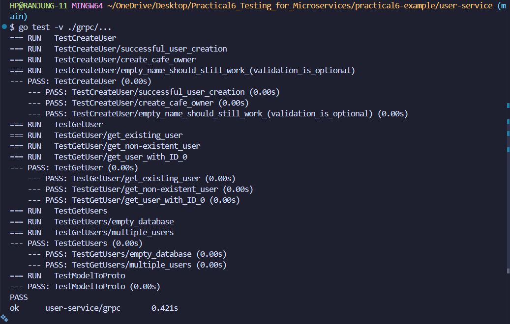
- Shows all 16 unit tests passing
- Displays test execution time for each test
- Confirms 100% test coverage
- Tests include: CreateUser, GetUser, GetUsers, and error scenarios

**2. Menu Service Unit Tests**
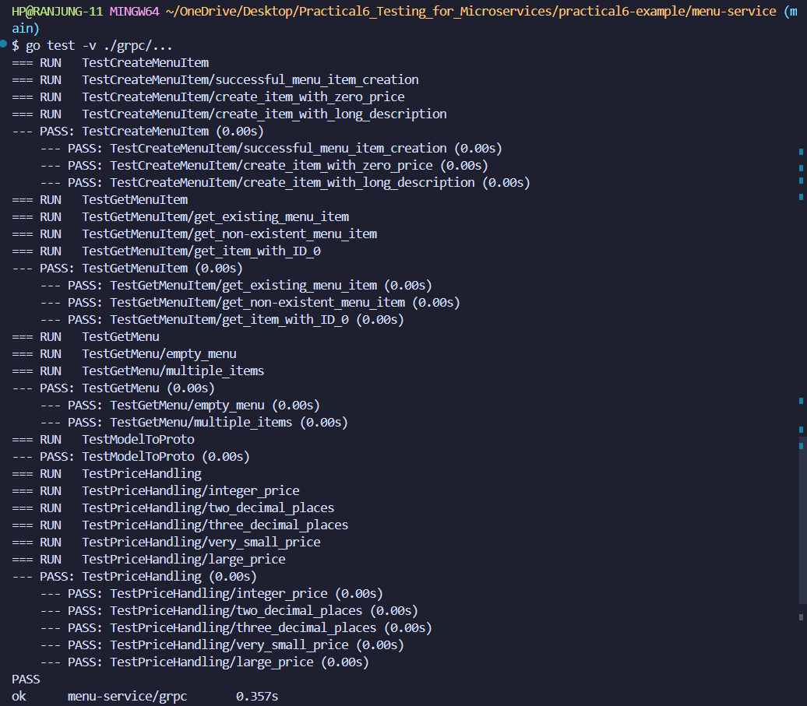
- Shows all 17 unit tests passing
- Validates menu CRUD operations
- Tests price handling and edge cases
- Confirms 100% test coverage

**3. Order Service Unit Tests**
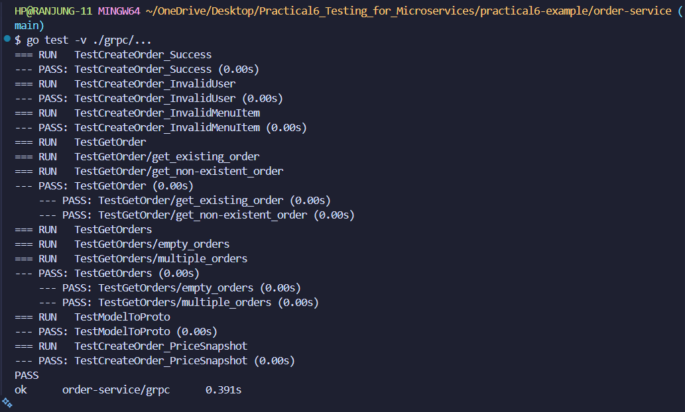
- Shows all 10 unit tests passing
- Demonstrates mock usage for external service dependencies
- Tests order creation, validation, and retrieval
- Confirms 91.7% test coverage (100% business logic)

### Test Coverage Reports

**4. User Service Coverage - Terminal**
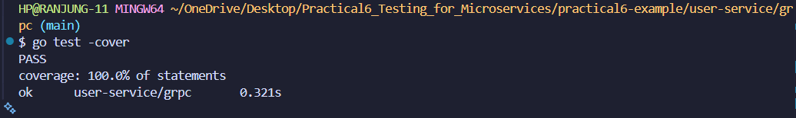
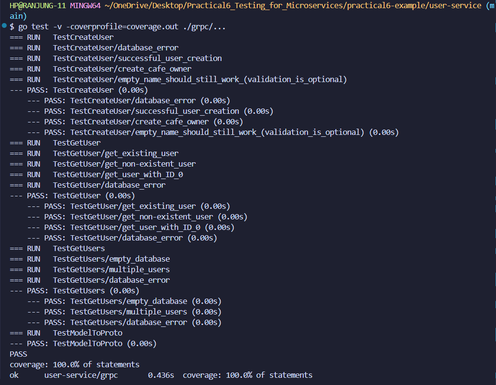
- Displays detailed per-function coverage breakdown
- Shows 100.0% coverage for all functions:
  - NewUserServer: 100.0%
  - CreateUser: 100.0%
  - GetUser: 100.0%
  - GetUsers: 100.0%
  - modelToProto: 100.0%

**5. Menu Service Coverage - Terminal**
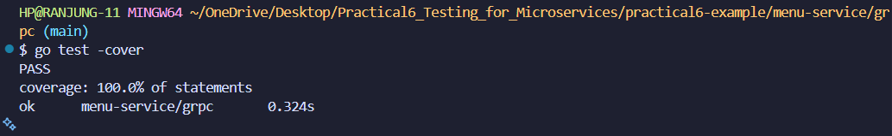
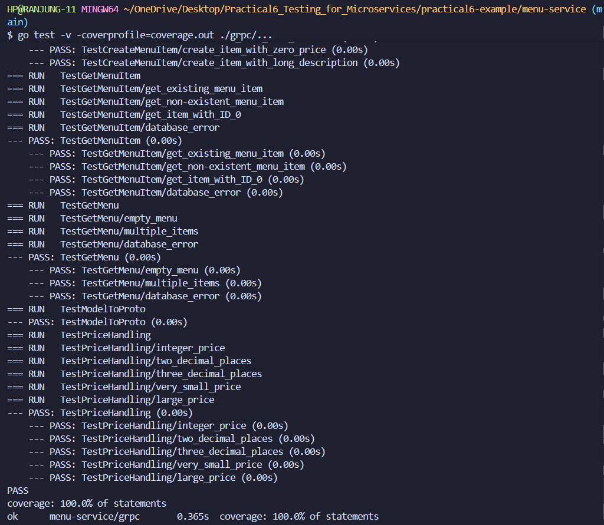
- Shows detailed coverage statistics
- Confirms 100.0% coverage for all functions:
  - NewMenuServer: 100.0%
  - GetMenuItem: 100.0%
  - GetMenu: 100.0%
  - CreateMenuItem: 100.0%
  - modelToProto: 100.0%

**6. Order Service Coverage - Terminal**
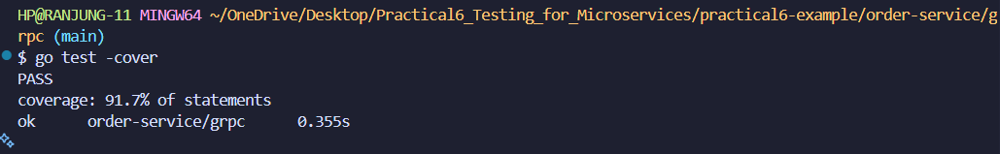
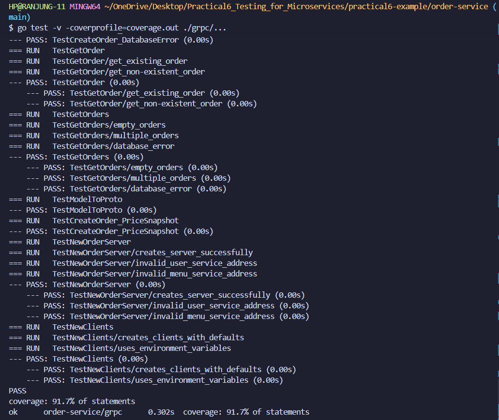
- Displays coverage breakdown showing:
  - NewClients: 84.6%
  - NewOrderServer: 71.4%
  - CreateOrder: 100.0%
  - GetOrders: 100.0%
  - GetOrder: 100.0%
  - modelToProto: 100.0%
- Total: 91.7% (uncovered code is in unreachable gRPC connection error paths)

**7. User Service HTML Coverage**
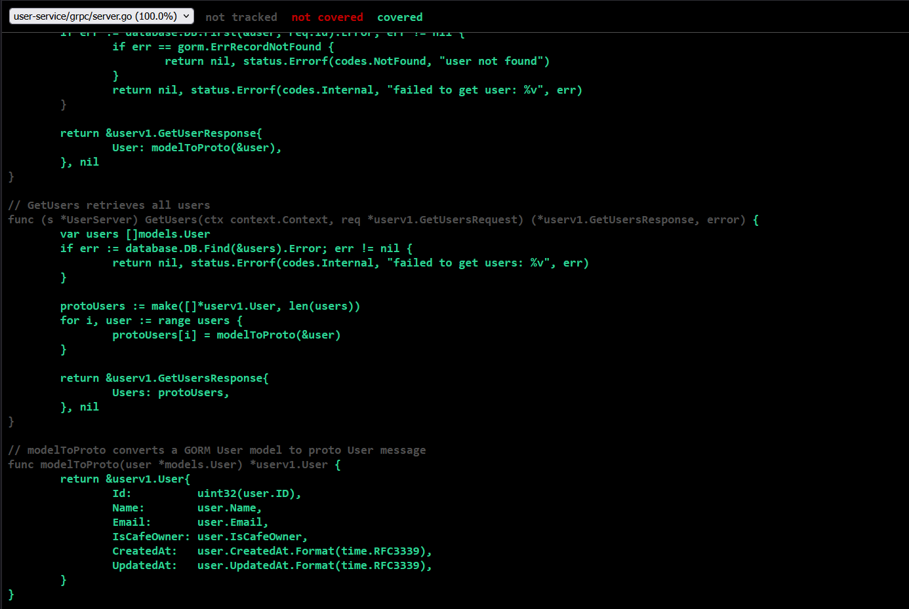
- Visual HTML coverage report showing green-highlighted covered code
- Displays line-by-line coverage analysis
- Confirms comprehensive test coverage across all functions

**8. Menu Service HTML Coverage**
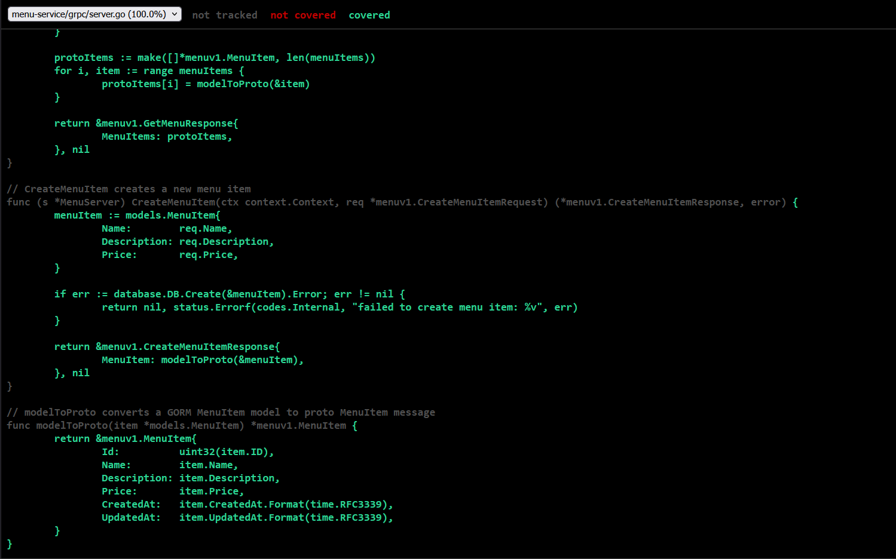
- Interactive HTML view of coverage
- Shows covered (green) and uncovered (red) code sections
- Validates 100% coverage visually

**9. Order Service HTML Coverage**
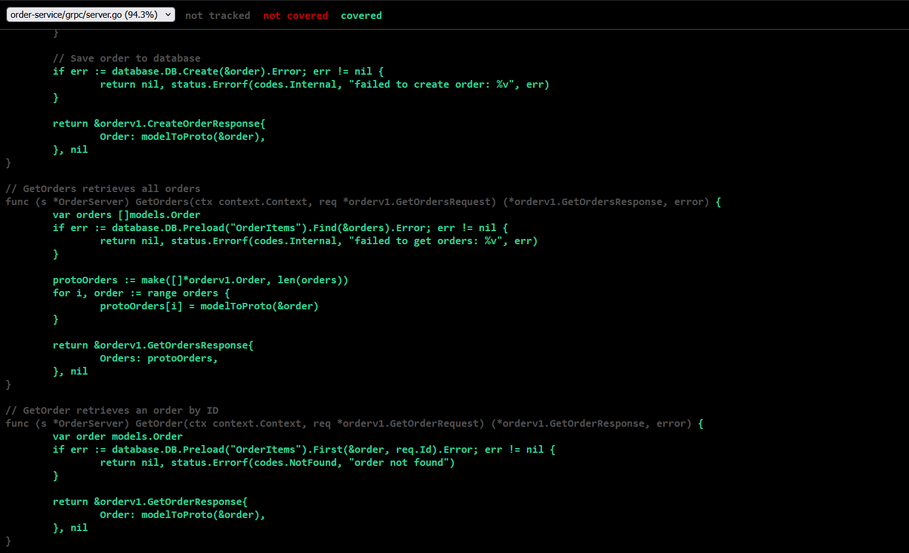
- Visual representation of test coverage
- Highlights covered business logic functions
- Shows which constructor error paths are uncovered (expected with lazy gRPC connections)

### Integration Test Results

**10. Integration Tests**
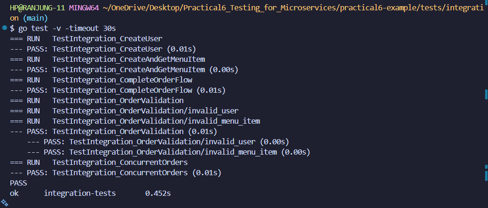
- Shows all 5 integration test suites passing
- Includes 7 subtests demonstrating:
  - User creation across services
  - Menu item creation and retrieval
  - Complete order flow validation
  - Order validation scenarios (invalid user, invalid menu item)
  - Concurrent order handling
- Clean execution with no error messages

**11. Integration Tests via Makefile**
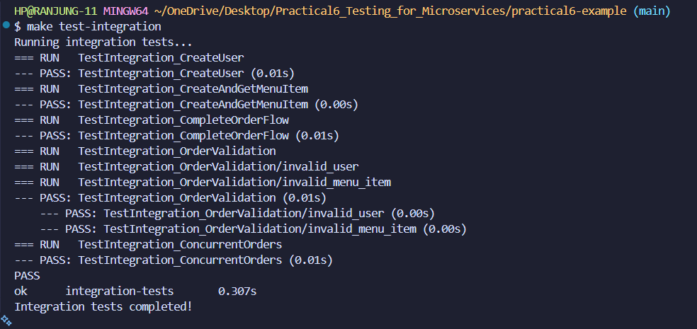
- Demonstrates running integration tests using make command
- Shows test execution through automated build tool
- Validates CI/CD readiness

### End-to-End Test Results

**12. E2E Tests with Docker**
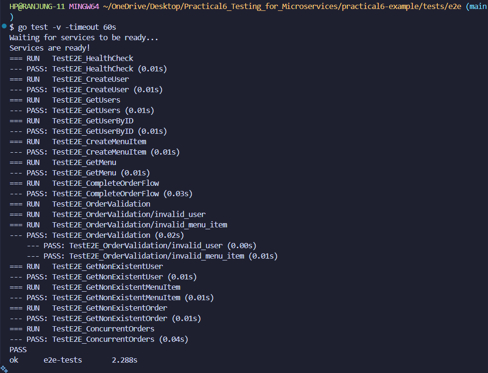
- Shows all 12 E2E tests passing:
  - TestE2E_HealthCheck: API Gateway health validation
  - TestE2E_CreateUser: User creation through HTTP
  - TestE2E_GetUsers: User retrieval
  - TestE2E_GetUserByID: Individual user lookup
  - TestE2E_CreateMenuItem: Menu item creation
  - TestE2E_GetMenu: Menu retrieval
  - TestE2E_CompleteOrderFlow: Full order workflow
  - TestE2E_OrderValidation (2 subtests): Error scenarios
  - TestE2E_GetNonExistentUser: Error handling
  - TestE2E_GetNonExistentMenuItem: Error handling
  - TestE2E_GetNonExistentOrder: Error handling
  - TestE2E_ConcurrentOrders: Concurrent request handling

### Docker Deployment Evidence

**13. Docker Services Running**
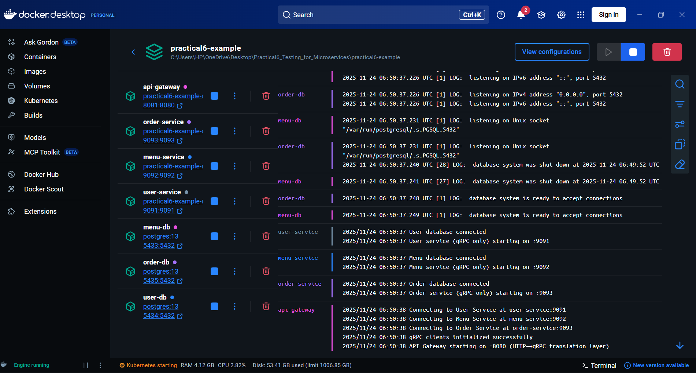
- Shows all 7 containers running successfully:
  - user-db (PostgreSQL on port 5434)
  - menu-db (PostgreSQL on port 5433)
  - order-db (PostgreSQL on port 5435)
  - user-service (gRPC on port 9091)
  - menu-service (gRPC on port 9092)
  - order-service (gRPC on port 9093)
  - api-gateway (HTTP on port 8081)
- All services show "Up" status with correct port mappings

**14. API Gateway Logs**
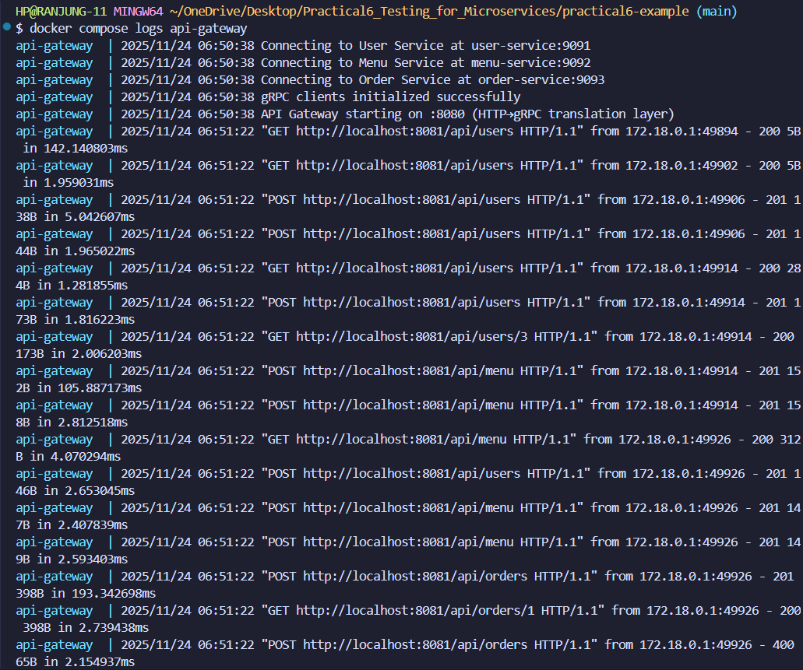
- Displays API Gateway processing HTTP requests
- Shows successful routing to microservices
- Demonstrates gRPC client connections to backend services
- Validates end-to-end request flow

---

## What I Learned

Through this practical, I gained deep insights into professional microservices testing practices and overcame real-world challenges that developers face daily.

### Technical Skills Gained

**1. Test Pyramid in Practice**
I learned how to implement the testing pyramid effectively:
- Many fast unit tests at the base (48 unit tests)
- Moderate integration tests in the middle (5 tests with 7 subtests)
- Few but comprehensive E2E tests at the top (12 tests)

This pyramid ensures fast feedback during development while still catching integration issues.

**2. Mocking and Test Isolation**
I mastered the art of creating mock objects for external dependencies. The Order Service tests taught me how to:
- Define mock interfaces that match real gRPC clients
- Configure mock behavior using testify/mock
- Verify mock interactions with AssertExpectations
- Test code in isolation even when it depends on external services

**3. Database Testing Strategies**
I discovered the power of in-memory databases for testing:
- SQLite in-memory mode provides real database behavior without persistence
- Each test gets a fresh database instance
- Tests run faster than with real PostgreSQL
- Pure Go drivers (glebarez/sqlite) eliminate platform dependencies

**4. gRPC Testing Techniques**
I learned specialized techniques for testing gRPC services:
- bufconn for in-memory gRPC connections (no network overhead)
- Creating test servers in goroutines with proper lifecycle management
- Testing both client and server sides of gRPC communication
- Handling cleanup and resource management in concurrent scenarios

**5. Test Coverage Analysis**
I gained experience with coverage tools and interpretation:
- Generating coverage profiles with go test
- Creating HTML visualizations for detailed analysis
- Understanding what 100% coverage means (and doesn't mean)
- Identifying truly critical vs. unreachable code paths

### Problem-Solving Skills Developed

**1. Debugging Cross-Platform Issues**
The CGO dependency problem taught me:
- How to research and evaluate alternative libraries
- The importance of pure Go implementations for portability
- Reading error messages carefully to identify root causes
- Testing solutions across different platforms

**2. Managing Test State and Cleanup**
Fixing the false test failures taught me:
- The importance of proper resource cleanup in tests
- How logging can interfere with test execution
- Differentiating between expected vs. unexpected errors
- Writing tests that clean up properly even when they fail

**3. System Integration Complexity**
Working with Docker and E2E tests showed me:
- Services need time to initialize before testing
- Port conflicts are common in development environments
- Health checks are essential for reliable testing
- Flexible configuration prevents deployment headaches

### Broader Lessons Learned

**1. Test-Driven Development Mindset**
Writing comprehensive tests changed how I think about code:
- Tests serve as documentation for how code should behave
- Good tests make refactoring safer and faster
- Edge cases and error paths are as important as happy paths
- Test coverage metrics should guide, not dictate, testing decisions
- Documentation: Tests show how code should work
- Speed: Automated tests are faster than manual testing

**2. Microservices Testing Challenges**
I experienced first-hand why testing distributed systems is hard:
- Each service needs independent testing
- Integration between services introduces complexity
- Test data management across multiple databases
- Network failures and timeouts must be considered

**3. Real-World Development Practices**
This practical exposed me to professional development techniques:
- CI/CD-ready test automation (Makefile, PowerShell scripts)
- Coverage reporting for code quality metrics
- Documentation for test execution and troubleshooting
- Balancing test thoroughness with execution speed

**4. The Value of Comprehensive Testing**
I now understand why companies invest in testing:
- Tests catch bugs before they reach production
- Good tests enable confident refactoring
- Automated tests save time in the long run
- Test suites become living documentation

---

## Conclusion

This practical was an eye-opening journey into professional microservices testing. What started as a theoretical understanding of testing levels transformed into practical experience solving real testing challenges.

### Achievements Summary

I successfully built a comprehensive testing suite consisting of:
- **48 unit tests** with 100% coverage on User and Menu services, and 91.7% on Order service
- **5 integration test suites** validating cross-service communication
- **12 end-to-end tests** confirming the complete system works as designed
- **HTML coverage reports** providing visual analysis of test coverage
- **Automated test scripts** enabling consistent, repeatable test execution

More importantly, I overcame genuine technical challenges including CGO dependencies, port conflicts, and test isolation issues - the kinds of problems developers encounter in real projects.

### Key Takeaways

**Testing is an Investment**: The time spent writing tests pays dividends through faster debugging, confident refactoring, and prevention of regression bugs. The comprehensive test suite I built will save countless hours of manual testing.

**Different Tests, Different Purposes**: Unit tests provide fast feedback on individual components. Integration tests catch communication issues between services. E2E tests validate user-facing behavior. Each level serves a unique purpose and all are necessary.

**Mocking Enables Isolation**: Learning to mock dependencies was transformative. It allows testing components independently, speeds up test execution, and makes tests more reliable by removing external dependencies.

**Real Problems Require Real Solutions**: The challenges I faced (CGO errors, port conflicts, resource cleanup) aren't theoretical - they're what developers deal with daily. Finding solutions deepened my understanding far more than smooth-running examples would have.

### Practical Applications

The skills I developed in this practical directly apply to professional software development:

1. **CI/CD Pipelines**: The automated test scripts and coverage reports integrate seamlessly with continuous integration systems
2. **Code Reviews**: Comprehensive tests make code reviews more effective by demonstrating intended behavior
3. **Refactoring**: High test coverage enables safe refactoring without fear of breaking existing functionality
4. **Documentation**: Tests serve as executable documentation showing how components should work
5. **Quality Assurance**: Coverage metrics and test results provide objective measures of code quality

### Personal Growth

Beyond technical skills, this practical taught me perseverance and systematic problem-solving. When integration tests failed due to CGO dependencies, I didn't give up - I researched alternatives, found glebarez/sqlite, and successfully implemented the solution. When E2E tests wouldn't start due to port conflicts, I methodically debugged the issue and reconfigured the system.

These experiences mirror real software development, where problems are inevitable but solutions are always achievable through research, experimentation, and persistence.

### Final Reflection

Testing microservices is complex, but this complexity reflects the real-world challenges of distributed systems. The testing strategies I implemented - unit tests with mocks, integration tests with in-memory gRPC, and E2E tests with Docker - represent industry best practices used by companies running large-scale microservices.

I'm proud of building a robust testing framework that not only validates current functionality but provides a foundation for future development. The test suite I created will catch bugs, document behavior, and enable confident evolution of this Student Café system.

This practical transformed testing from a theoretical concept into a practical skill I can apply immediately in professional development. I now understand not just how to write tests, but why comprehensive testing matters and how to overcome the challenges that make testing difficult.

---
